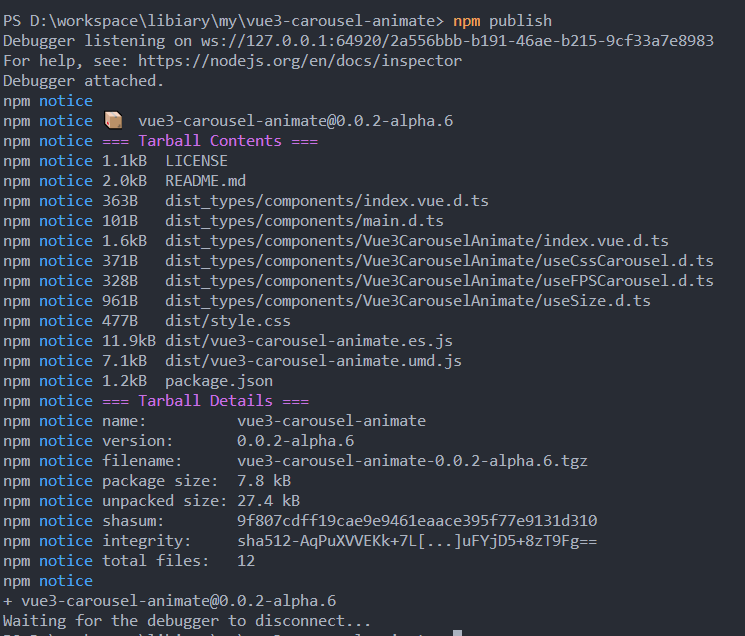
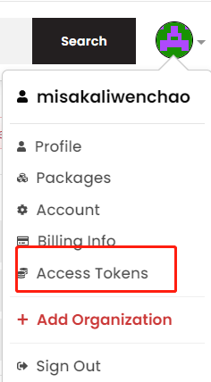

# Vite+Typescript+Vue3发布npm组件

## vite工程搭建

首先，依据[Vite官方文档](https://vitejs.dev/guide/)，搭建工程。  
命令行执行过程中，选择使用vue3,typescript。  
搭建完成后，就可以在`/src/components`文件夹中，编写自己的组件。

```sh
# 创建项目
npm create vite@latest
```


## 编译

在编写完成组件后，接下来就是编译。  
对于此项目来说，需要
1. 提取全部`vue`,`ts`文件的类型声明，获取`.d.ts`文件，作为npm包的类型文件。
2. 编译打包`vue`,`js`文件为 `.es.js`和`.umd.js`文件，分别提供用于`import`和`require`来引入。
3. 提取`vue`文件中的样式为独立的`.css`文件,用于单独进行引入.当然也可直接打包进步骤2的js文件中,作为内联css,具体参考 [github issue](https://github.com/vitejs/vite/issues/1579) [知乎](https://www.zhihu.com/question/470701634)。

为了完成上述编译流程，首先我们需要修改`vite.config.ts`,对build打包流程进行配置  

### vite.config.ts


```ts
import { defineConfig } from "vite";
import vue from "@vitejs/plugin-vue";
import { resolve } from "path";
// https://vitejs.dev/config/
export default defineConfig({
  plugins: [vue()],
  build: {
    lib: {
        // 入口
      entry: resolve(__dirname, "src/components/main.ts"),
      name: "vue3-carousel-animate",
      fileName: (format) => `vue3-carousel-animate.${format}.js`,
    },
    rollupOptions: {
      // make sure to externalize deps that shouldn't be bundled
      // into your library
      external: ["vue"],
      output: {
        // Provide global variables to use in the UMD build
        // for externalized deps
        globals: {
          vue: "Vue",
        },
      },
    },
  },
});

```

formates字段没有配置，默认是打包`['es', 'umd']`两种格式文件

对于`rollupOptions.external`:配置后，目标库不会被打包进输出文件中，也就是打包的组件不会包含vue框架本体。  
同时，还需要配置`output.global`来把vue添加到全局,保证打包后的组件，不会出现找不到vue的问题


### package.json编译指令

修改build指令如下，使用vue-tsc，提取出项目的类型声明文件，之后再进行编译  

```json
  "scripts": {
    "build": "vue-tsc --declaration --emitDeclarationOnly && vite build",
  },
 

```

### tsconfig.json

核心提取`.d.ts`配置如下,类型声明文件将被`vue-tsc`提取到配置的`./dist_types`文件夹下  

```json
{
  "compilerOptions": {
    "baseUrl": "./",
    "declaration": true,
    "declarationDir": "./dist_types/",
    "declarationMap": false,
    "outDir": "./dist_types/"
  },
}

```

### package.json发布配置

[配置参考此处](../PackageJson.md)


```json
{
  "name": "vue3-carousel-animate",
  "private": false,
  "version": "0.0.2-alpha.6",
  "license": "MIT",
  "files": [
    "dist",
    "dist_types/components/"
  ],
  "module": "./dist/vue3-carousel-animate.es.js",
  "main": "./dist/vue3-carousel-animate.umd.js",
  "exports": {
    ".": {
      "import": "./dist/vue3-carousel-animate.es.js",
      "require": "./dist/vue3-carousel-animate.umd.js"
    },
    "./dist/style.css": {
      "import": "./dist/style.css",
      "require": "./dist/style.css"
    }
  },
  "typings": "./dist_types/components/main.d.ts",
  "keywords": [
    "vue3",
    "carousel"
  ],
  "repository": {
    "type": "git",
    "url": "https://github.com/Yukilwc/vue3-carousel-animate.git"
  },
}

```


## 手动发布npm

先去npm网站注册一个账号，然后在项目中，运行如下指令

```sh
npm login
npm publish
```
发布成功后如下:




## 推送master分支自动发布npm

### NPM_TOKEN配置

登录npm网站，在头像下拉菜单中，点击access tokens,然后在页面中 generate new token



拿到获取的token，登录github账户，进入项目的设置中，进入secrets->actions,点击 new repository secret,创建一个名为NPM_TOKEN的新密钥  

### github actions

项目根目录创建文件`.github/workflows/publish.yml` 
```yml
name: Publish Package to npmjs
on:
  push:
    branches: [master, main]
jobs:
  build:
    runs-on: ubuntu-latest
    steps:
      - uses: actions/checkout@v3
      # Setup .npmrc file to publish to npm
      - uses: actions/setup-node@v3
        with:
          node-version: "16.x"
          registry-url: "https://registry.npmjs.org"

      - name: Cache dependencies
        uses: actions/cache@v2
        id: npm-cache
        with:
          path: |
            **/node_modules
          key: ${{ runner.os }}-npm-${{ hashFiles('**/package-lock.json') }}
          restore-keys: |
            ${{ runner.os }}-npm-

      # install dependencies if the cache did not hit
      - name: Install dependencies
        if: steps.npm-cache.outputs.cache-hit != 'true'
        run: npm install

      - run: npm run build
      - run: npm publish
        env:
          NODE_AUTH_TOKEN: ${{ secrets.NPM_TOKEN }}
```

由此，每当合并到主分支时，则会自动发布到npm  
当然如果想要创建release时再发布，也可以修改触发方式为  

```yml
on: 
  release:
    types: [created]
```

## 参考资料

[Vite build library mode](https://vitejs.dev/guide/build.html#library-mode)

[build-lib](https://vitejs.dev/config/#build-lib)

[rollup](https://rollupjs.org/guide/en/#big-list-of-options)

[tsconfig配置](https://www.typescriptlang.org/tsconfig)
