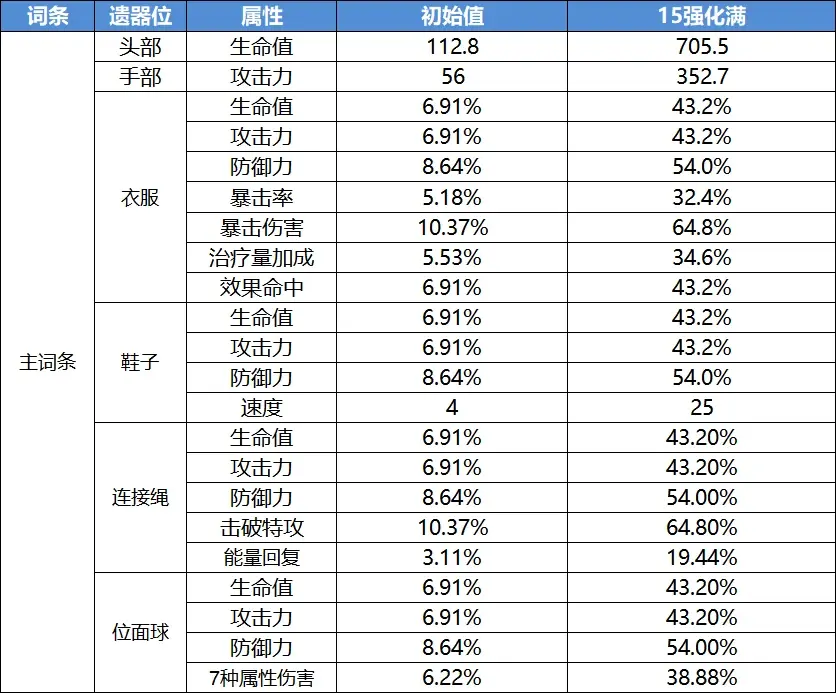
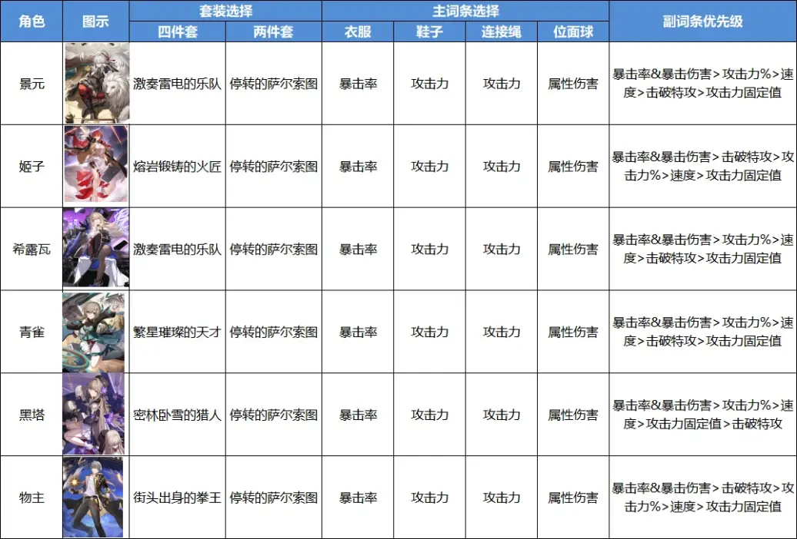
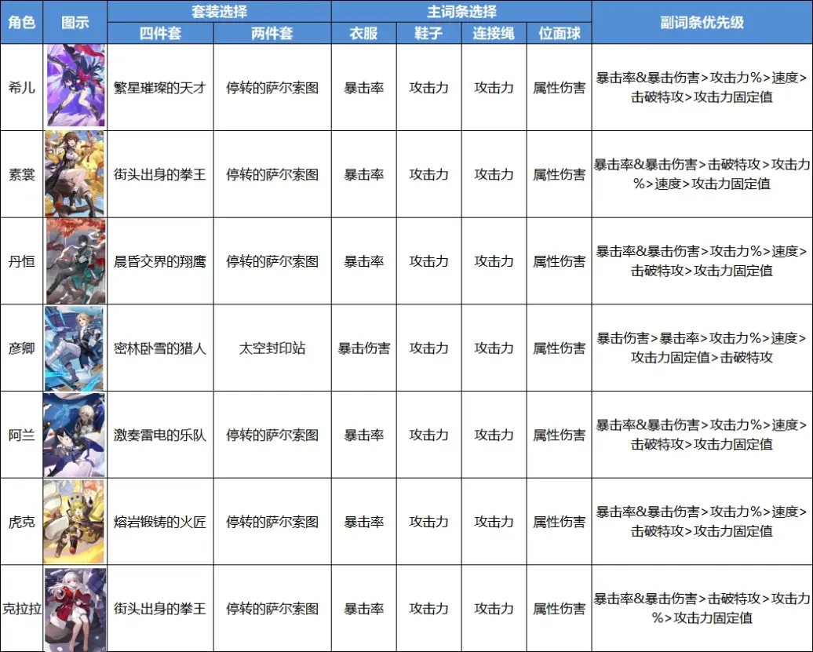
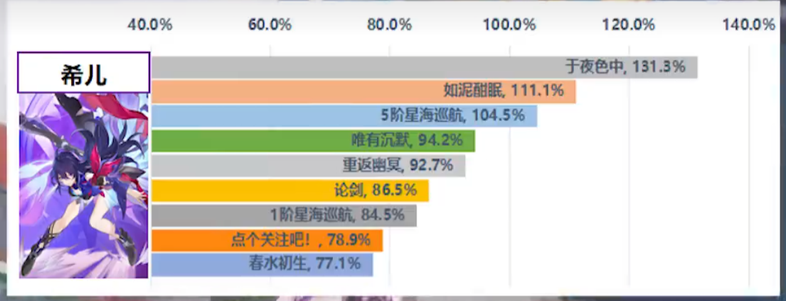
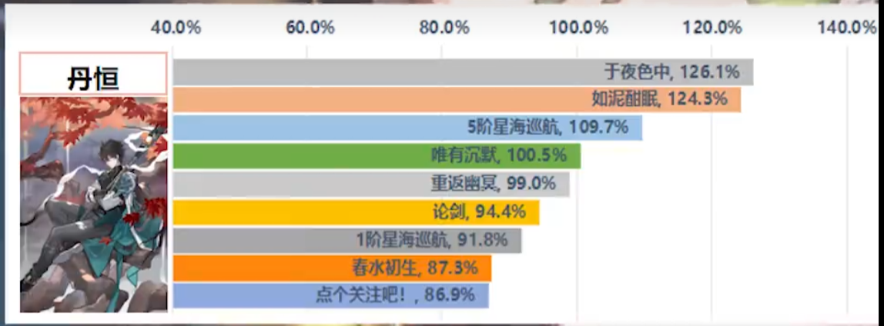
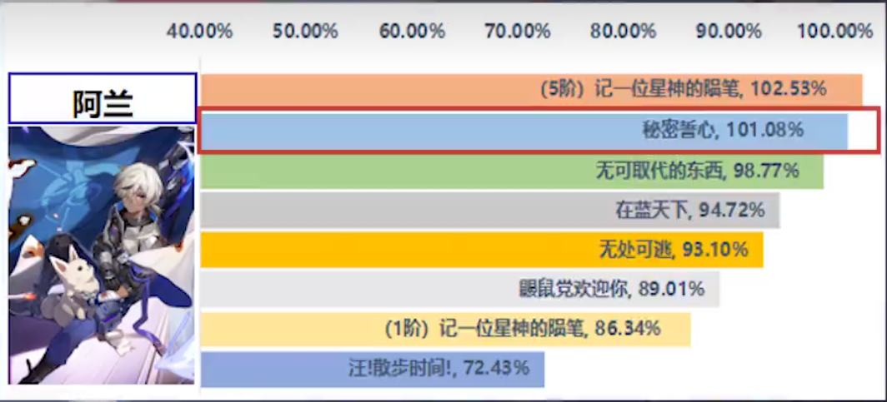
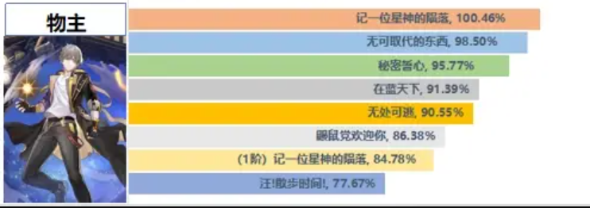
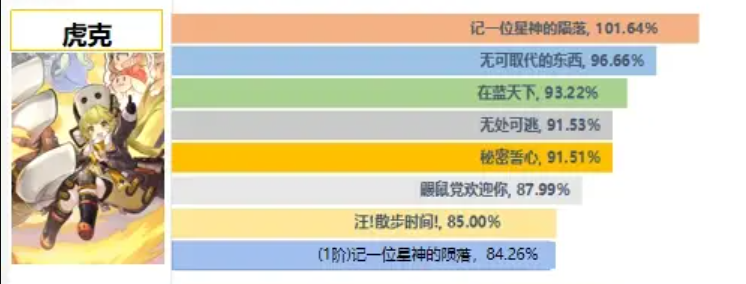
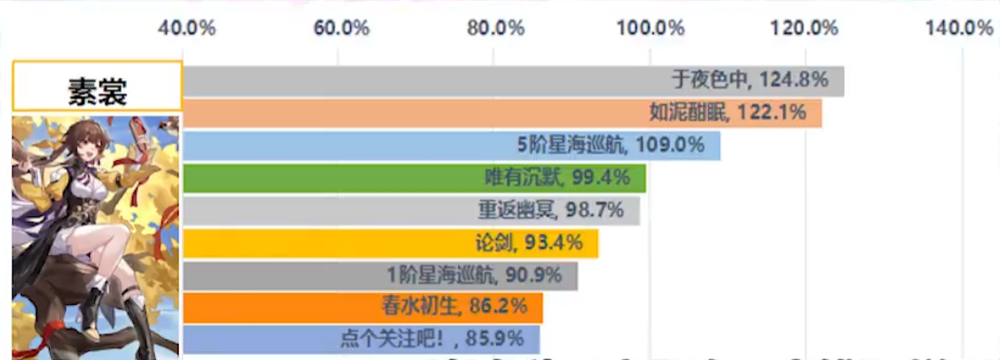
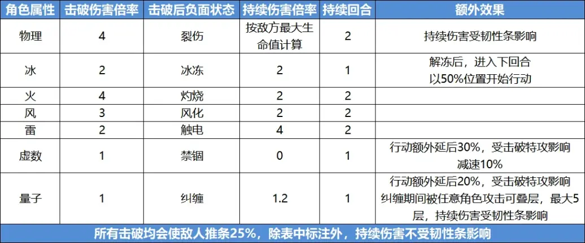

# 星铁笔记

## 遗器相关

零命希儿需要穿攻速鞋子

遗器里，
* 帽子 手套固定词条
* 衣服7个
* 鞋子4个
* 链子5个
* 球10个

### 角色遗器推荐

## 兑换相关

大月卡光锥：

* 优先 镂月裁云之意 同谐辅助类的光锥，如果抽到了 但战斗还未结束 ，则可选取其他光锥。
* 如果打算抽景元，则需要选 今日亦是和平的一日 ，智识，是仅次于景元专属的第二光锥。
* 其他的在模拟宇宙有替代，或者不强，都不用选了。

星芒商店：

* 优先换 但战斗还未结束 ，同谐最强光锥

忘却之庭商店：

* 都很弱
* 建议在 早餐仪式感(智识) 和 等价交换(丰饶) 里选一个换。

模拟宇宙商店：

* 记一位星神的陨落，毁灭最强输出光锥
* 星海巡航 ， 巡猎第三强光锥
* 剩下那个存护的不选择

## 角色养成策略

### 希儿

光锥:

### 丹恒

光锥:

### 阿兰

光锥:

### 物主

光锥:

### 虎克

光锥:

### 素裳

光锥:

## 机制

