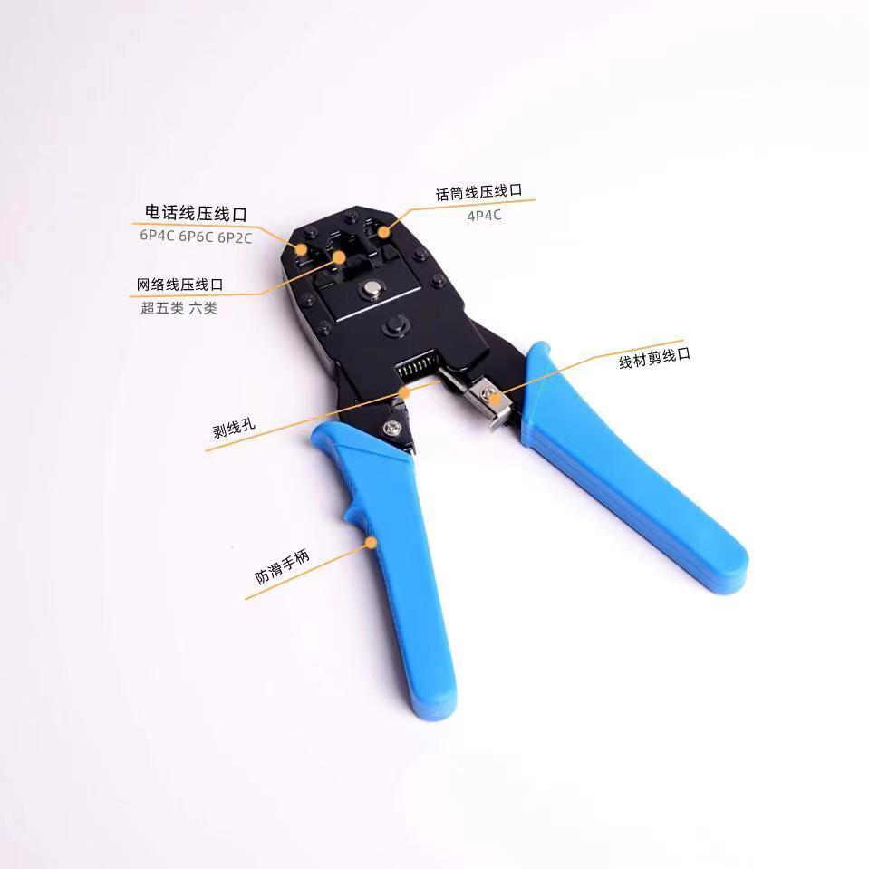
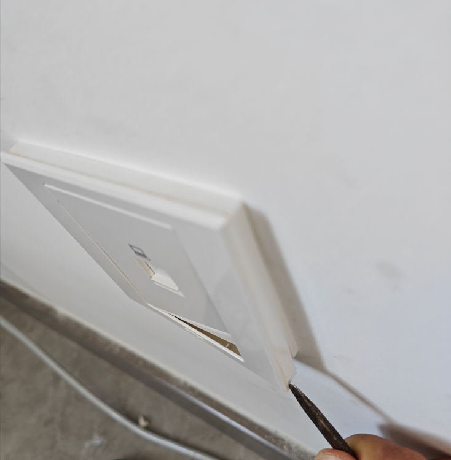
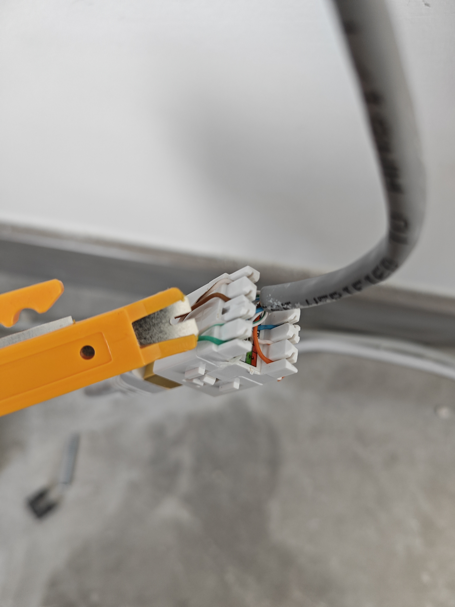
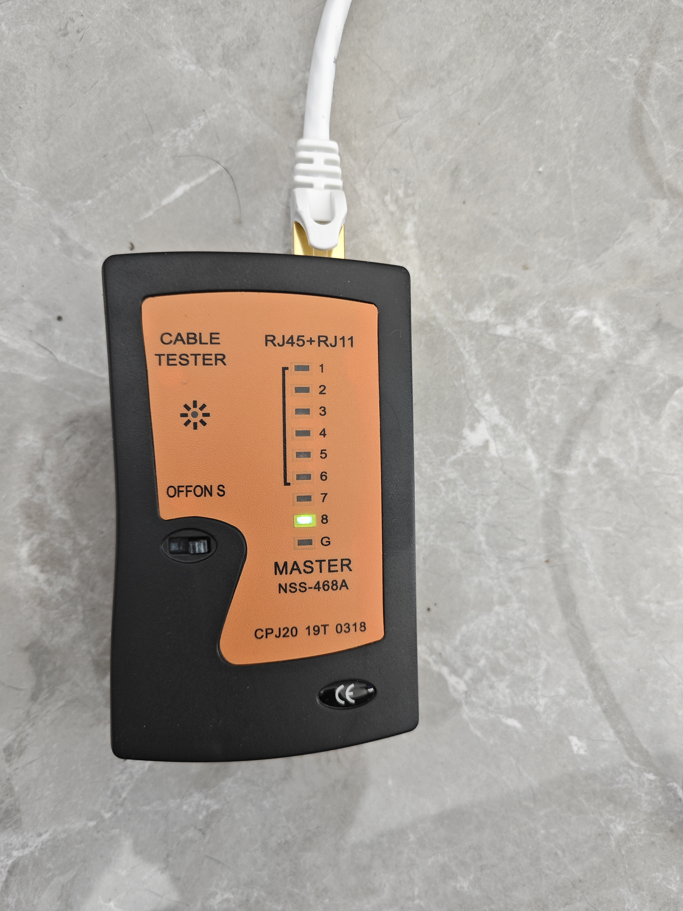
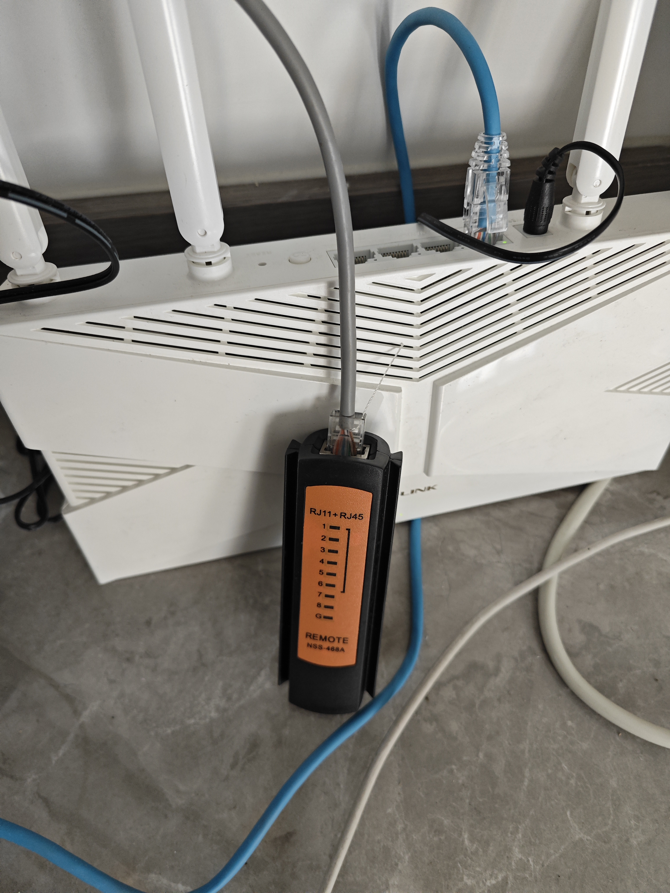
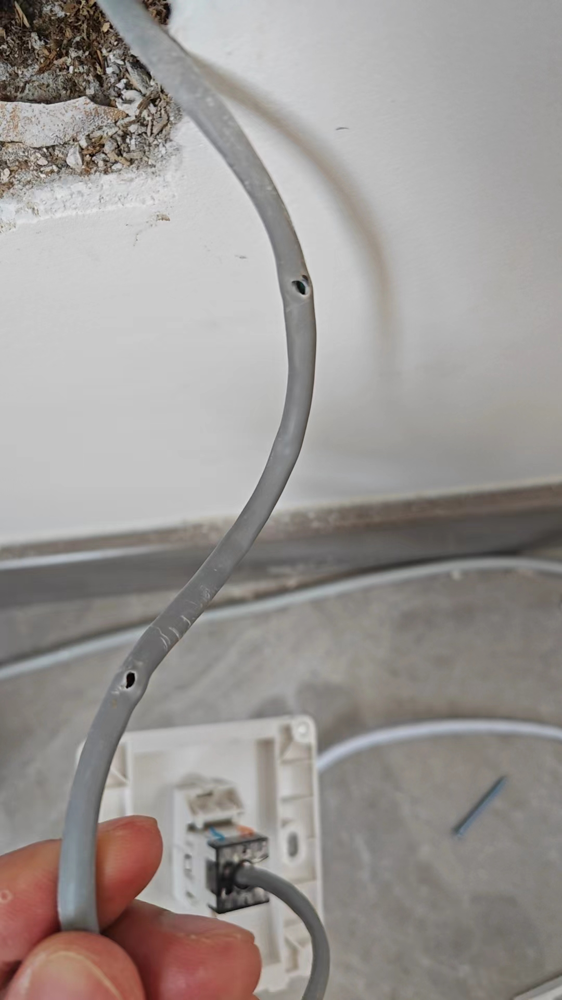
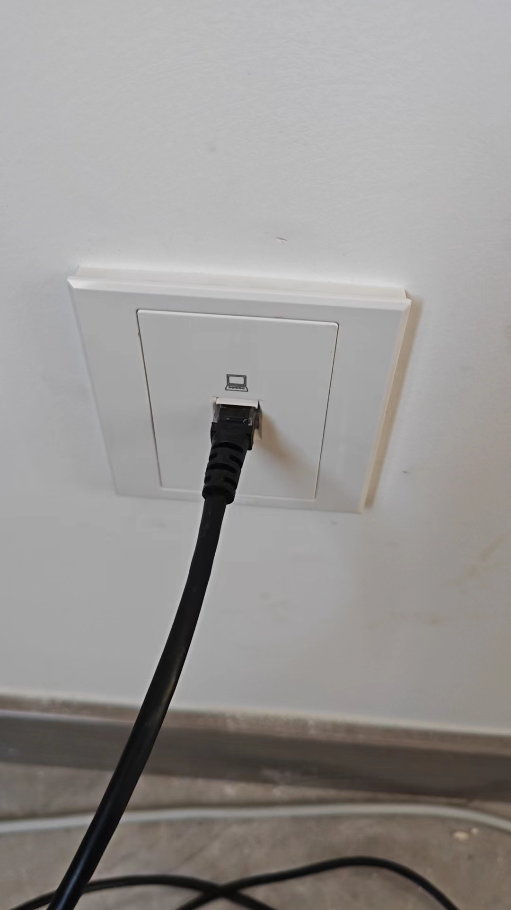

# 接网线

## 概要

记录接墙上的网线面板的流程。

## 准备的工具

网络面板，包括保护壳子，固定壳子，还有接入网线的接口。

拼多多直接买一套网络常用工具，例如水晶头，网线，直通线，多功能压线钳，剥线/压线的小黄刀，网线连通测试仪。

## 网络面板

1. 如果面板正在墙上，那第一步是把墙上的面板拆下来。

面板最外层的保护外壳一般是卡扣卡在固定壳子上，对此类卡扣式外壳，基本就要找到大概的卡扣位置，
然后使用平口螺丝刀，往松动卡扣的位置撬开。像我这个，就是从右下角撬动，能较为轻易的撬开。可以看到，
我这款面板的卡扣有四个，从一角撬起可以松动一个，然后剩下的错位就好松动了。

2. 取下网线接口，按顺序接入网线。  

把面板上的接口拿下来，两侧有两个小卡扣，按压即可轻松拿下。

使用剥线钳，把网线外皮剥掉部分，露出八根线。

把网线接口上，覆盖的压线的盖子取下来，盖子也是通过两侧中间的卡扣卡住，
用平口螺丝刀撬中间即可打开。

按照接口上的B类顺序，或者网上查找下顺序，
把八根线按顺序压入卡口中。

3. 压紧网线

八个卡扣，深处都有小刀片，当压紧网线时，会自动通过刀片，切开表皮，连通电路。
为了确保压紧，务必使用专门的工具。

4. 测试连通。

给刚接好的网口，插入一根网线。

使用测试仪，把测试仪分开，左边一端连在刚接好的网口，右边远程测试端，接入网口另一边，
也就是连接路由器的那头，从而形成连通。

这里切忌，不要只连接左侧，而另一侧接路由器，那会造成八口连通的假象。

之后开启测试仪，观察八个口的连通情况，未连通的口需要再压一下，直到全部指示灯都能亮起。

扣上按压盖子，然后把接口插回面板。

5. 安装面板。

这里唯一需要注意的是，切勿让螺丝，扭紧时，穿透背后的网线。
线材过长时会有这个问题。

6. 完成

最终效果

## 水晶头

水晶头类似上述流程，只有压紧部分，可以使用压线钳。