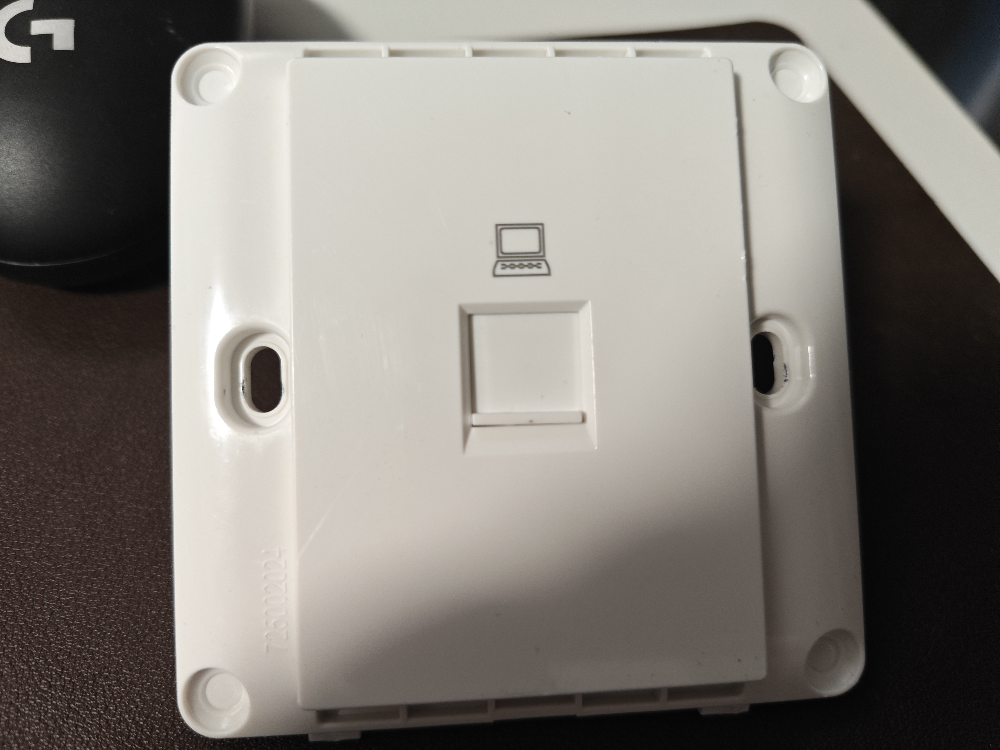
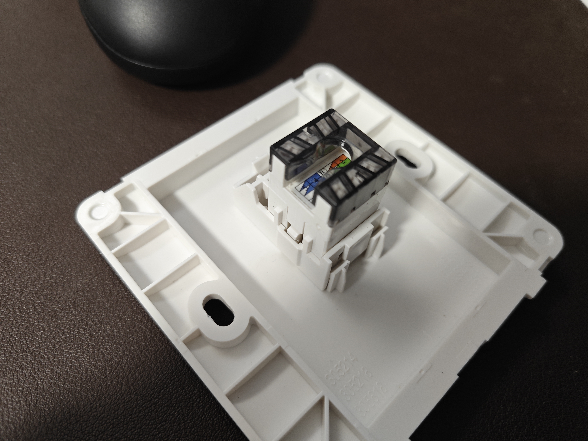
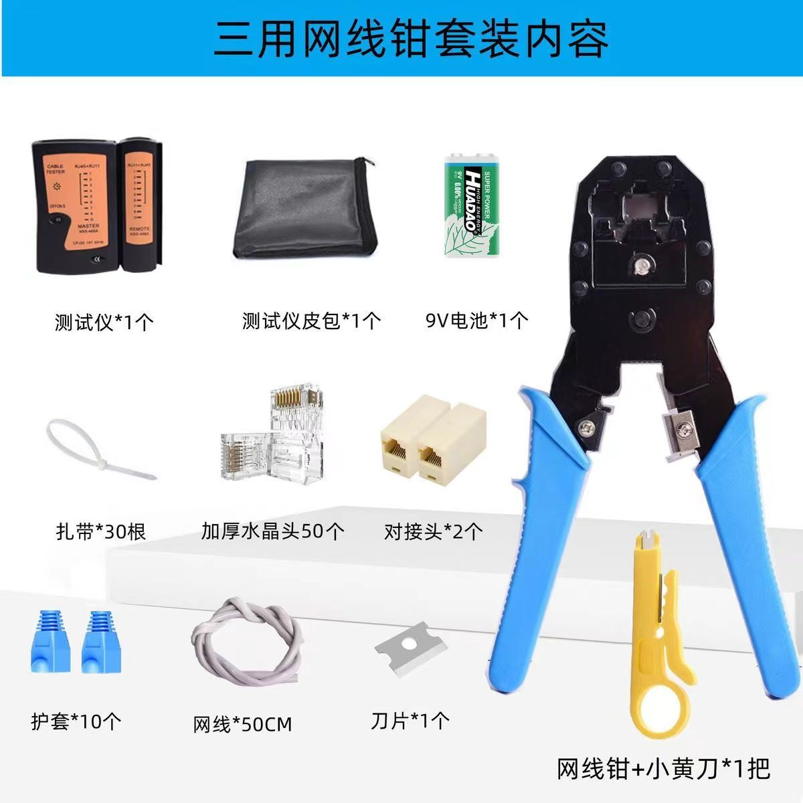
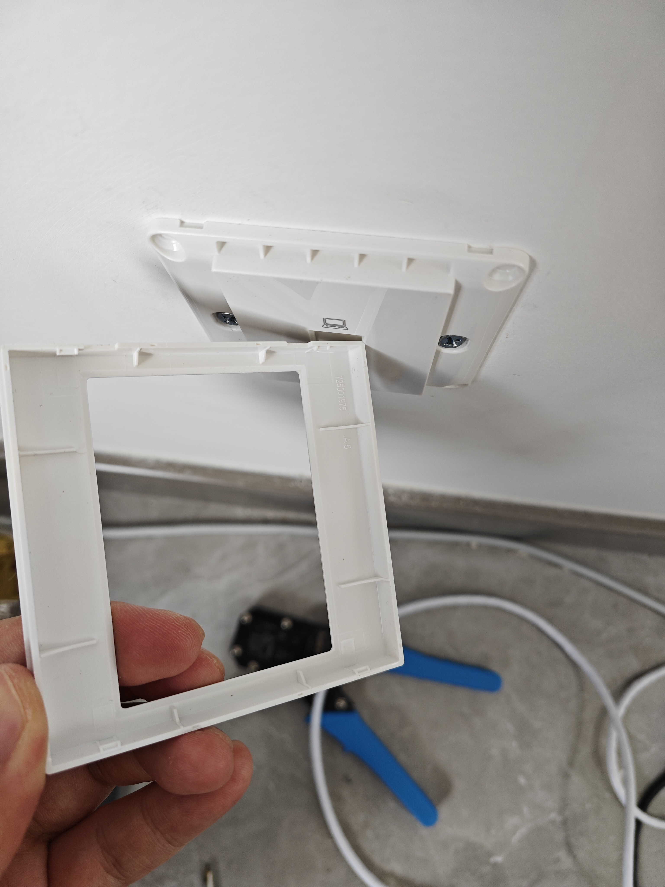

# 接网线

## 概要

记录接墙上的网线面板的流程。

## 准备的工具

网络面板，包括保护壳子，固定壳子，还有接入网线的接口。

拼多多直接买一套网络常用工具，例如水晶头，网线，直通线，多功能压线钳，剥线/压线的小黄刀，网线连通测试仪。

## 网络面板

1. 如果面板正在墙上，那第一步是把墙上的面板拆下来。

面板最外层的保护外壳一般是卡扣卡在固定壳子上，对此类卡扣式外壳，基本就要找到大概的卡扣位置，
然后使用平口螺丝刀，往松动卡扣的位置撬开。像我这个，就是从右下角撬动，能较为轻易的撬开。可以看到，
我这款面板的卡扣有四个，从一角撬起可以松动一个，然后剩下的错位就好松动了。

2. 取下网线接口，按顺序接入网线。  

把面板上的接口拿下来，两侧有两个小卡扣，按压即可轻松拿下。

使用剥线钳，把网线外皮剥掉部分，露出八根线。按照接口上的B类顺序，或者网上查找下顺序，
把八根线按顺序压入卡口中。

3. 压紧网线

八个卡扣，深处都有小刀片，当压紧网线时，会自动通过刀片，切开表皮，连通电路。
为了确保压紧，务必使用专门的工具。

## 水晶头