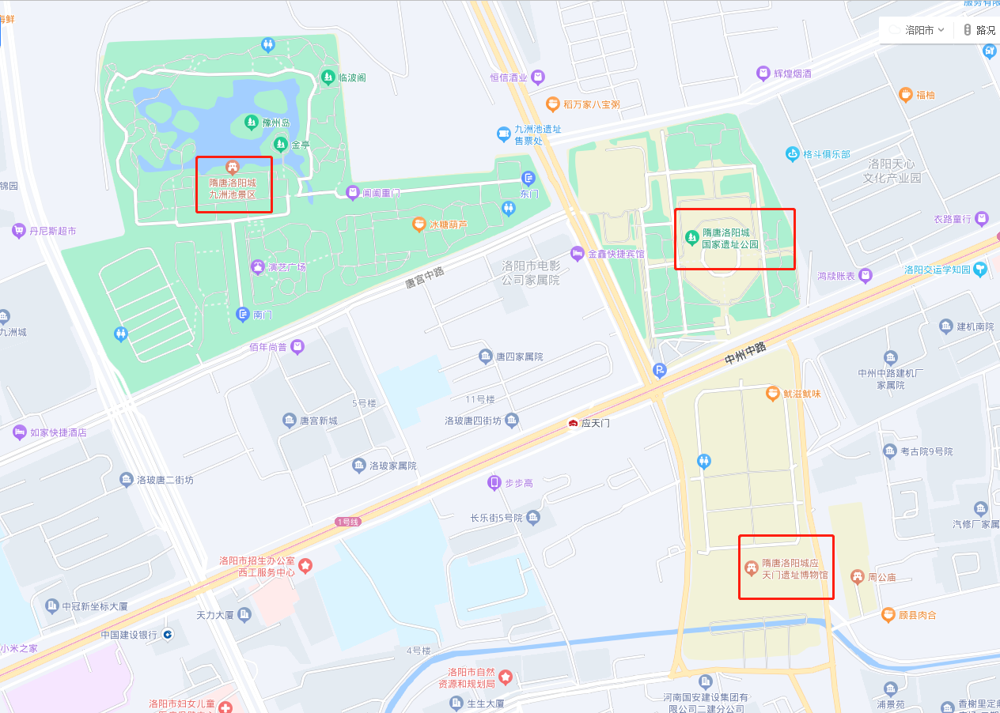

# 洛阳游记

## 待办事项

## 概述

洛阳位于洛水之北，水之北谓之“阳”，故名洛阳。她是河洛文化和华夏文明的重要发源地，有十三个正统朝代将洛阳设为文化，经济，行政中心，她拥有5000多年文明史，4000多年建城史和1500多年建都史，是中国历史上建都最早，朝代最多，历时最长的城市。洛阳也是隋唐大运河中心城市和丝绸之路东方的起点。

此次旅行，以游览古都遗址，感受古都的历史为核心，希望能在现代，体会到这千年时光的变迁与魅力。

想要理解一个城市，做一次真正的旅行，就得先学习容纳对应的知识，在此基础上才能更好的欣赏其风土人情，文化底蕴，也能更好的进行规化，所以下面先介绍一些洛阳的基本信息，最后再做出旅行规划。
  
## 行政区划

去一个新的城市，首先要掌握其基本得行政区划，为的是能对其地理格局有一个基本了解。

核心市区部分，按洛河南北划分，主要是洛河北的涧西区，老城区，西工区，洛河南的洛龙区。基本交通，食宿也都会围绕这几个区。

## 景点

按照行政区划分

### 老城区

**隋唐洛阳城国家遗址公园 天堂明堂 应天门**

隋唐洛阳城国家遗址公园是修建在隋唐洛阳皇宫紫微城遗址的核心区域，主要分布有唐代的明堂、天堂和九洲池等建筑遗址。天堂和明堂是隋唐皇宫中最重要的建筑之一，
也是隋唐洛阳城国家遗址公园的两大景点之一。

应天门是隋唐洛阳城宫城紫微宫的正南门，也是隋唐洛阳城中轴线上著名的“七天建筑”之一. 它始建于隋大业元年（605年），在隋代称则天门，神龙元年（705年）避武则
天讳，改为应天门，后又称五凤楼. 应天门是当时朝廷举行重大国事庆典和外交活动的重要场所，见证了很多历史事件. 应天门是一门三道结构，上有崇楼五座，以游廊相
连，东西各有一座阙亭，形如雁翅，似五只凤凰. 应天门的阙楼高约36.4米，是隋唐两京考古发掘出的第一座三出阙城门遗址. 应天门的建筑形制对后代都城建设有深远影
响，具有极大的历史价值和学术价值.

九洲池是隋唐洛阳城宫城内一处重要的皇家池苑建筑，也是武则天时期的皇家园林，荟萃了隋唐宋三个园林建筑艺术的精华，可谓中国古代皇家园林的杰出典范. 九洲池因似东海的九洲而得名，占地十顷（约52万平方米），水深丈余（约3.4米），堤岸屈曲，池中有数座岛屿，鸟鱼翔泳，花卉罗植24. 九洲池遗址公园占地288亩，包括宫城西北部的大内寝殿区，宫城北部的陶光园局部和宫城以西西隔城中北部的九洲池皇家园林这三部分，共12处遗址，通过多种科学手段进行保护性展示。

::: tip
天堂名堂门票和应天门遗址门票是各自需要单独买的。而九州池看着好像不需要门票也不需要预订。
:::

**丽景门 丽景门老街**

丽景门是洛阳古城的西大门，始建于隋代，是百官及万民祭祀神的地方. 现在的丽景门景区是在洛阳市政府原址上重建而成，由城门楼、瓮城、箭楼、城墙、丽景桥和护城河等部分组成，同时也是洛阳老街的所在地。  

::: tip
感觉逛下老街就行，丽景门没必要买门票去看了。  
:::

**洛邑古城**

洛邑古城是洛阳古时的旧称，也是洛阳市老城区的一个景区，被誉为“中原渡口”. 景区总规划面积1360亩，首期规划建设面积280亩，包含文峰塔、河南府文庙、妥灵宫、四眼井、金元古城墙遗址等多个历史时期保护建筑，是集游、玩、吃、住、购于一体的综合性人文旅游观光区. 景区内还有九龙殿、三神殿、娘娘殿、天后宫等建筑，以及洛阳三彩艺术馆、白桦林风景油画馆等展览馆. 景区还有梨园剧社，每天上演各种传统戏曲和民俗表演.  景区内的房屋瓦舍都挂有灯笼，夜晚时分灯笼亮起，别有一番风情.

::: tip
景区不需要门票，只需要刷身份证进入.
:::

**鼓楼**

**十字街的夜市小吃**

**九龙鼎**

### 西工区

**王城公园**

### 洛龙区

**龙门石窟**，地处龙门高铁站以南。  

**关林庙**，处龙门站东北。  

**白马寺**，地处洛河以北，洛龙区很东面。

**洛阳博物馆**，洛河以南，靠河较近，紧靠**隋唐城遗址植物园**

## 景点地图

## 餐饮

管记水席老店

**小街锅贴**

## 交通

## 计划行程

### 5.12 Day1

* 上午前往青岛西站坐高铁
* 午饭火车上吃，以及**带点小零食**
* 下午两点到达并收拾完成，去九州池，换古装
* 九州池逛完，前往王城广场，小街锅贴吃饭
* 吃完饭后去应天门遗址
* 7：00开始看唐宫表演
* 8:00多看夜景
* 回宾馆

### 5.13 Day2

* 早餐周边逛逛看看，如果没有，则额外买下宾馆的早饭门票
* 跟团整天龙门石窟+少林寺
* 中午**待定**
* 晚上逛老街，洛邑古城，**吃水席待定**

### 5.14 Day3

* 上午去白马寺 **7天内买票，也就是7号预定下票**
* 中午找地方吃饭，**吃啥待定**
* 12点退房
* 前往龙门高铁站回家

## 预算汇总

当下剩余 1500元 预留1000，剩余500可使用

唐宫 872

火车票 1688

团票 3492

酒店 166

吃饭预算，一顿200，3顿 600+其他 共800

白马寺 140

其他零碎费用 打车 导游等 400

合计 7558， 去除给的2500，消费 5000

## 餐饮与交通安排

特色餐饮：水席，羊肉汤，炒刀削面

[本地人的参考](https://zhuanlan.zhihu.com/p/61560818)

| 事件                       | 安排                                                    | 备选  |
| -------------------------- | ------------------------------------------------------- | ----- |
| 第一天5.12                 |                                                         |       |
| 早餐                       | 6:00-7:00 家里解决                                      |       |
| 出发                       | 7:00出发前往青岛西站，取票进站                          |       |
| 动车                       | 8:20发车 G2259:7:44青岛北站--8:20青岛西--13：36洛阳龙门 |       |
| 午餐                       | 12:00 动车上买，同时**准备点面包零食**                  |       |
| 接车与宾馆                 | 13:36-14:30**提前咨询下接车服务**                       |       |
| **告知宾馆，后续入住房间** | 汉庭酒店(洛阳火车站店) 到时候不用换房间了就             |       |
| 去景区                     | 14:30-17:00 九州池等                                      |       |
| 晚饭                       | 17:00-18:00 去王城广场-小街锅贴                         |       |
| 晚景点                     | 18:00左右-19:00-21:00 去唐宫，看夜景，随便逛逛          |       |
| 结束                       | 21:00搭车回宾馆                                         |       |
| 第二天5.13                 |                                                         |       |
| 早餐                       | 5:40-6:40 周边小吃/宾馆买早餐票                         |       |
| 出发                       | 6:40-9:40  大巴                                         |       |
| 少林寺                     | 9:40-12:00                                              |       |
| 午餐                       | 12:00-13:00  **待定**                                   |       |
| 出发                       | 13:00-14:30                                             |       |
| 龙门石窟                   | 14:30-17:30                                             |       |
| 宾馆                       | 18:30                                                   |       |
| 晚饭                       | 19:00-20:00 **待定** ，不疲惫:水席                      | 疲惫: |
| 夜晚，老街 洛邑古城        | 20:00-21:00                                             |       |
| 宾馆                       | 21:00 打车回去                                          |       |
| 第三天5.14                 |                                                         |       |
| 早餐                       | 7:00-8:00 同上一天                                      |
| 白马寺                     | 8:00-9:00-11:00                                         |       |
| 午饭                       | 11:00-12:00 **待定**                                    |       |
| 退房                       | 12:00                                                   |       |
| 高铁站                     | G1856:14:30-19:58，我多买补票去青岛北                   |       |
| 回家                       | 19:58-21:00                                             |       |

**核心备忘**

必带身份证
