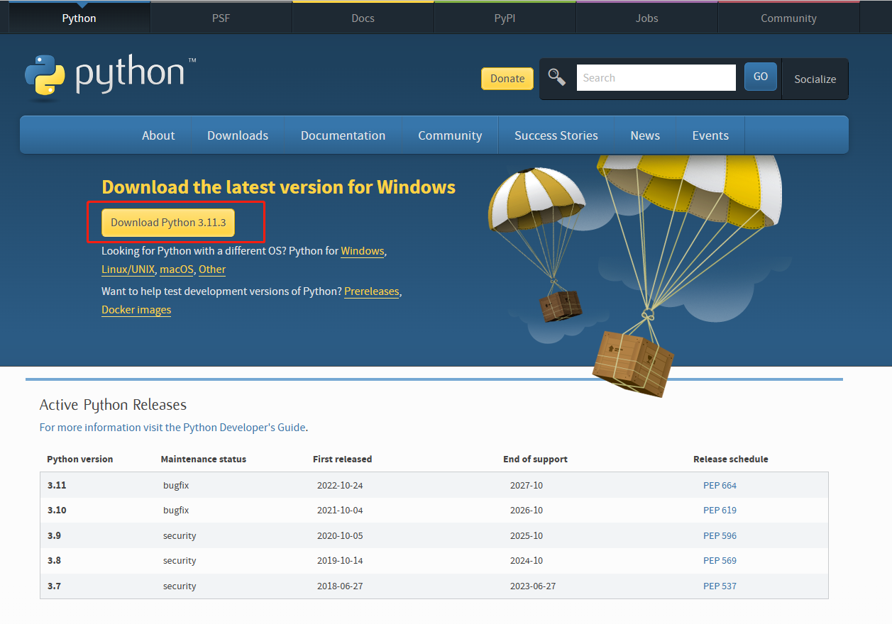
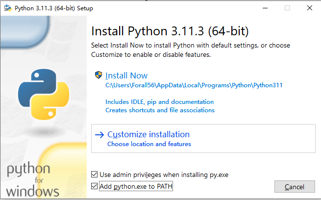
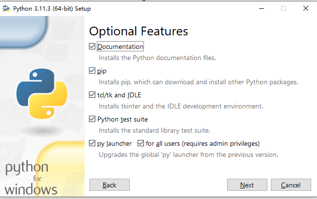
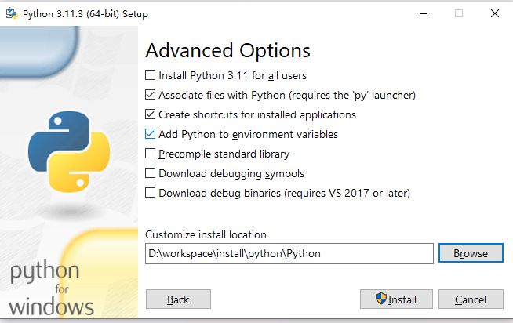
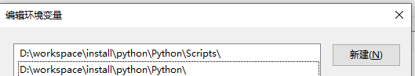
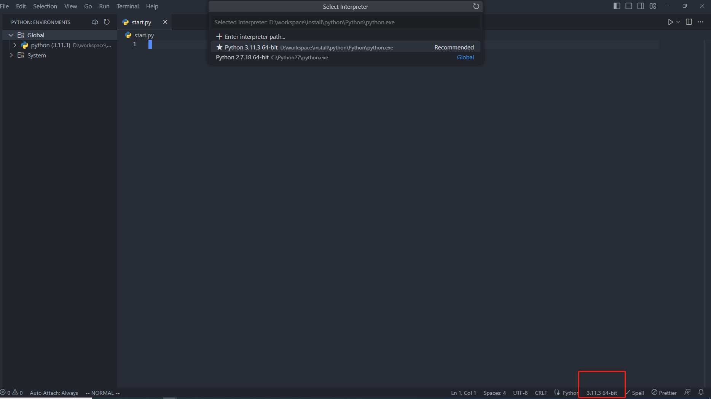
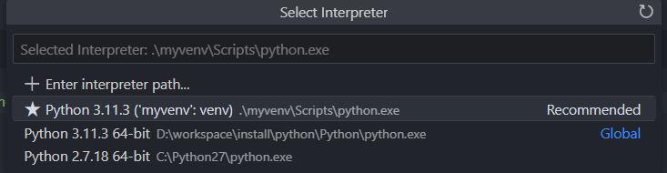
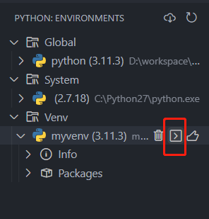
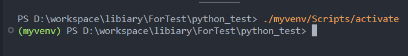

# Python之旅 快速开始

## 概述

本文尽可能详细的描述自己学习安装python，到建立起一个工程运行起来的过程。  
笔者是前端出身，很多流程可能保留着nodejs，npm的前端工程的思路与想法。我相信一门成熟的语言与框架，总是殊途同归的，其语言特性，开发环境流程
总是存在共性。  
我会尽可能追根究底，安装时保持好奇心，碰到的问题尽可能查明白，力求知其然，知其所以然。  

## 安装Python

Python有2和3两个大版本，现在3已经较为通用，这里在Windows平台，安装Python的3系版本，前往 [官网](https://www.python.org/downloads/)下载安装包。



下载完成后，双击安装文件开始安装。之后进入安装流程的第一步。

### 选择安装方式



在第一个画面，选择**Customize installation**,自定义安装，如此后续可以指定安装位置。
底部两个选项默认勾选，

::: tip
* Use admin privileges when installing py.exe，这个选项选中，保证以管理员身份安装，防止缺少权限导致安装失败。
* Add python.exe to PATH，会自动添加环境变量。


:::

### 可选择的特性



在这个画面默认选中全部选项。

**documentation**

这个选择后，会在本地安装一个文档程序，在开始菜单中，点击python 3.11 module docs，会自动一个本地网页，就是python文档。

**pip**

pip是下载安装python依赖包的核心工具，选择后，会安装在python安装目录下的Script文件夹中，后续会详细描述其用法。

**IDLE**

这是一个自带得python开发的IDE开发环境，一般都不会使用，后续开发使用vscode就足够了。

**Python test suite**

python测试套件，需要安装，给一些工具方法写单元测试是好文明。

**py launcher**

这是一个window程序，可以让你查找或者运行不同的python版本。可以通过命令行参数，或者直接在py脚本里添加注释，来控制使用哪一个版本的python解释器。
它可以取代`python`命令，来指定固定版本的python解释器进行启动。

例如，当你同时安装了python2和python3，你可以通过下面几种方式来指定使用哪个版本。

* 在py脚本开头首行添加一个注释`#! python3`
* 在命令行中使用`py`命令运行python解释器，例如`py -3.11`。还可以运行`py -0p`来查看本机安装的全部python版本。 参数中的0是列出python主要版本，p
  的意思是path，列举出所在路径。

::: tip
想知道py等指令存放的位置，可以直接在命令行中运行`where py`，就可以查看其安装位置。
:::

### 高级选项



默认上述选项即可，然后选择想要安装的目标目录，然后点击安装。

安装完成后，可以打开命令行，运行`py --version`，输入当前python版本，即表示安装成功。

这里大概解释下这些高级选项的含义。

**Install python for all users**

给windows全部用户安装python。对应的环境变量应该也会变成全局，而非当前User了。

**Associate files with python**

关联python文件，这样会自动识别对应后缀的文件为python脚本。如此，就和mp4文件之类一样，双击可以直接调用python解释器执行，而不需要选择打开方式。

**Add Python to environment varivables**

添加Python到环境变量中

**Precompile python standard library**

预编译python标准库的.py文件为.pyc字节码文件，可提升使用标准库时的运行速度，当然也会占用更多安装时的额外空间。

**Download debugging symbols,Download debug binaries**

Download debugging symbols意味着下载用于调试Python的符号文件（.pdb文件）。
这些文件可以帮助你在Visual Studio等开发工具中调试混合模式的Python/C++代码。 如果你不使用Visual Studio或者不需要调试混合模式的代码，你可以不选择这个选
项。如果你选择了这个选项，你需要同时选择Download debug binaries，这样才能下载适用于.NET开发的调试符号。

## 一些配置

### 环境变量

python在安装过程中，经过选择，已经自动配置好了环境变量，因此**无需再额外手动配置**，这里仅介绍下相关的环境变量。



`\Python\Scripts\`：这个环境变量是用来存放一些Python的脚本文件的，比如pip或其他第三方模块的命令行工具。

`\Python`：这个环境变量是用来存放Python的主程序文件的，比如python.exe或pythonw.exe。

而py launcher使用的py命令，是放到了`C:\Windows`文件夹中。

可执行下面的命令来验证环境变量是否配置完善。  

```sh
# 输出python版本
py --version
# 输出pip版本
py -m pip --version
```

### 为pip配置国内镜像源

一般通过pip安装依赖时，都是从[国外的源](https://pypi.org/)下载，容易下载缓慢。推荐修改成清华大学的镜像源。  

一种方式是安装时临时指定，例如：
```sh
pip install -i https://pypi.tuna.tsinghua.edu.cn/simple Pillow
```

还有一种就是永久指定：
```sh
# 配置源 会打印 Writing to C:\Users\YourName\AppData\Roaming\pip\pip.ini
pip config set global.index-url  https://pypi.tuna.tsinghua.edu.cn/simple
# 打印pip配置
pip config list
# 重置回 https://pypi.org/simple
pip config unset global.index-url
```
### IDE Vscode配置

直接在vscode扩展处搜索python，安装：
* Python，调试，智能提示，格式化等基础功能支持。
* Python Indent，python风格的缩进支持。
* Python Environment Manager，管理多个版本的python
* IntelliCode，AI辅助开发，能快速查询github上的demo进行参考。

安装完成后，可以在vscode底部，或者使用安装的Python Environment Manager，切换当前工作区的python版本。



## 工程构建与运行

### 简单项目构建

新建文件夹，新建一个文件，名字为`start.py`，添加内容

```py
print("Hello Python")
```

参考配置章节的Vscode配置，指定好当前的解释器版本。

接着F5，执行，可以看到控制台打印出了相关文本。


### 调试运行

通过F5运行程序，可以进入断点，也可以在断点的上下文内查看变量当前内容。 

如果使用命令行，可以执行如下：

```sh
# 以脚本形式运行，只要路径正确，就能执行
py start.py
# 以module形式运行 关于module的概念，在后续文章中介绍
# 添加了-m后，python会在sys.path和当前项目中查找对应的名为start的module，然后作为脚本执行
# 必须能找到一个名为start的module，这和上面命令的路径是不同的。
py -m start
```


## 依赖管理

### 安装

#### 全局安装

直接执行安装指令`py -m pip install Pillow`，会发现，当前项目下并无任何变化，这是安装包到了全局。
执行`py -m pip show Pillow`可以查看到详细的包信息，发现包被安装到了Python安装包下的一个路径 
`D:\workspace\install\python\Python\Lib\site-packages`。 
默认使用pip的全局安装，容易导致多个项目的依赖产生版本冲突，所以并不推荐。下面介绍使用虚拟环境安装管理依赖。

#### 使用虚拟环境

如果存在多个复杂项目，把依赖安装到全局并非是好选择，这时候就想尽可能让项目自己包含依赖，从而实现更好的独立，从而避免依赖版本不同的冲突。
虚拟环境是一个python环境，其内部的python解释器，pip，包，都是独立于全局系统级别的，这样对应的项目就能自成一体。

这样的好处：

* 你的开发环境被固定化到了一个项目中，和全局与其它虚拟环境实现了隔离。
* 可以很简单的打包应用或者分享应用。

**使用venv创建虚拟环境**

其原理是把python库拷贝一份到项目目录下，然后在该项目中，临时修改环境变量Path，让其指向当前项目下的Python库。

在命令行中运行指令`py -m pip venv myvenv`，最后一个参数是命名的虚拟环境变量名称。
运行完成后，项目会多出一个名为`myvenv`的文件夹，其目录内就是拷贝的一份python环境，存放于项目之下。

加下来就要**激活虚拟环境**

**结合vscode**

1. 切换到虚拟环境解释器。`ctrl+shift+p`,输入python，选择`Python:Select interpreter`，其中会看到虚拟环境的解释器，并选择。
   
2. 切换到虚拟环境命令行。使用插件或者直接通过命令行命令进入到虚拟环境终端中。此时终端前会显示一个`(虚拟环境名)`。  
   使用插件只需要找到插件显示得对应env内的环境，然后选择`Open in terminal`  
     
   如果使用命令行，则需要找到venv文件夹下的activate可执行程序，并运行`./myvenv/Scripts/activate`  
     
3. 如此在虚拟环境命令行中，运行`py -m pip install Pillow`，其对应的依赖，也会被安装下项目下的`myvenv\Lib\site-packages`文件夹下了。


#### 使用requirements.txt

已经有了requirements.txt,安装其列出的依赖：
```sh
pip install -r requirements.txt
```

默认的使用原始的纯pip，`pip install package`，是不会更新requirements.txt的。

#### 推荐的包管理工具

已经有了requirements.txt,安装其列出的依赖：

install安装时同步到requirements.txt:


### 引入

引入三方包

引入本地包

## 最终的项目创建流程

## 一个简单有用的程序

## 命令行相关汇总

以下如果非多版本python，或者配置了环境变量顺序，则可以省略前置的 py及其参数，例如 `py -3 -m`。

```sh
# -m的意思是module，是值要运行一个module，后面指定module是pip，也可以指定其它py文件或者exe
py -3 -m pip install Pillow
py -3 -m pip install --upgrade Pillow
py -m pip show Pillow
py -m pip list 
# 列举出安装的库
py -m pip freeze
# 列举出安装的库，并输出到requirements.txt
py -m pip freeze > requirements.txt
# 基于当前python解释器创建一个虚拟环境
py -m venv myvenv
```

## 其它问题

### 多python版本操作

当电脑安装了多个python版本，就需要使用py launcher的`py`指令来调用不同版本python解释器。  
直接调用`py`，会运行最近安装的python版本。  
使用参数指定版本，可以运行`py -3.11`来指定python版本。  
如果想指定一个`py`的默认版本，则需要windows环境变量`PY_PYTHON`，此变量不存在时，会默认为3。 

可以通过命令行实验一下：
```sh
# 默认打印空
$env:PY_PYTHON
# 默认为3 Python 3.11.3
py --version
# 设置为版本2
$env:PY_PYTHON = 2
# 打印为Python 2.7.18
py --version
# 设置为3
$env:PY_PYTHON = 3
# Python 3.11.3
py --version
```

当使用pip时，如果想要指定版本，需要
```sh
py -m pip --version
```
如果希望直接使用pip，并指定版本，那就只能调整下`\Python\Scripts\`环境变量的顺序了，把想要的版本排在上面，如此直接
使用`pip --version`即可。


## 参考

[怎样设置Python虚拟环境](https://www.freecodecamp.org/news/how-to-setup-virtual-environments-in-python/)