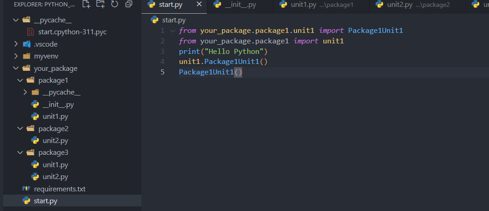
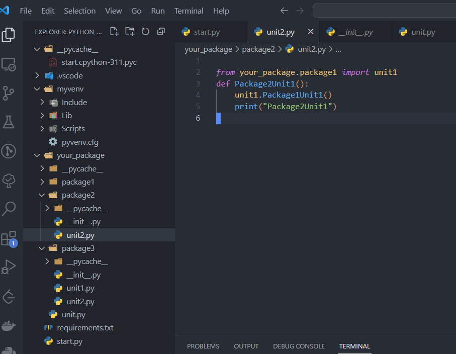
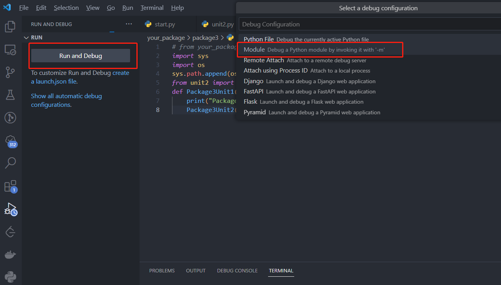

# 初学者Python之旅 项目构建


## TODO


以3W的形式重新组织，添加补充 需要明确段落的目的。

文笔润色

标题与首页目录重新设计

完善模板

加个前言，讲下要做什么，吸引人停留

## 前言

以前听过这样一句话，“人生苦短，我用Python”。
这话能够流传，就是因为Python简洁易学，相比其它语言，可以用更少的代码量和时间，完成同样的功能。

作为一个前端开发，日常工作和生活中，很多时候需要一些脚本，来处理冗余繁琐的操作，提升效率。例如：

* 编写脚本，从TTF字体文件中，仅提取出想要的中文字体。
* 对按规则匹配到的文件进行自定义的重命名，或者批量修改大量文件中的指定规则匹配的文本。
* 喜欢的网页文章或文档，能够自动将其抓取，然后转成PDF文件保存本地。

作为一门流行的编程语言，python在
人工智能，数据分析，Web开发，爬虫，自动化运维，图像处理等领域，都有对应的建树，拥有一个大而全面的生态。
之前笔者都是使用Gulp，在Nodejs环境下编写Js脚本，现在打算学习下Python，以后通过Python编写脚本，尝试下Python的生态。

本文主要记录自己学习Python的探索过程，从基础的安装，到运行起第一行Python代码。记录过程中遇到的问题，经过的流程，以及因为好奇心调研的
答案。这份记录也是为了自己准备的一份笔记，为的是当一段时间不用Python后，能够快速将之拾起。

笔者是前端出身，很多流程可能保留着nodejs，npm的前端工程的思路与想法。我相信一门成熟的语言与框架，总是殊途同归的，其语言特性，开发环境流程
总是存在共性。过程中我会尽可能做到知其然知其所以然，保持好奇，保持追根究底，争取明白每一个流程的含义，设计理念，以及怎样使用。

## 概要

本文介绍了自己从安装Python，到编写出第一个程序并运行的流程。其主要包含如下几个部分：

* 下载安装，解释安装过程中出现的选项。
* 安装后进行一些配置，包括环境变量，国内镜像源，作为IDE的Vscode配置。
* 接下来，创建一个文件夹和python文件，分别通过命令行和Vscode执行。
* 项目建立后，研究如何安装三方依赖，尝试了默认的安装，使用虚拟环境，以及使用requirements.txt保存依赖清单。
* 安装依赖后，引入模块，尝试了引入三方模块和引入本地定义的模块。
* 汇总了本次用到的命令行指令，便于后续速查使用。
* 最后解决了一些疑问，包括多版本管理问题，以及用文件/模块运行的情景问题。

## 安装Python

Python有2和3两个大版本，现在3已经较为通用，这里在Windows平台，安装Python的3系版本，前往 [官网](https://www.python.org/downloads/)下载安装包。


下载完成后，双击安装文件开始安装。之后进入安装流程的第一步。

### 选择安装方式


在第一个画面，选择**Customize installation**,自定义安装，如此后续可以指定安装位置。
底部两个选项默认勾选，

::: tip
* Use admin privileges when installing py.exe，这个选项选中，保证以管理员身份安装，防止缺少权限导致安装失败。
* Add python.exe to PATH，会自动添加Python.exe所在目录到环境变量Path。


:::

### 可选择的特性


在这个画面默认选中全部选项。

**documentation**

这个选择后，会在本地安装一个文档程序，在开始菜单中，点击python 3.11 module docs，会自动一个本地网页，就是python文档。

**pip**

pip是下载安装python依赖包的核心工具，选择后，会安装在python安装目录下的Script文件夹中，后续会详细描述其用法。

**IDLE**

这是一个自带得python开发的IDE开发环境，一般都不会使用，后续开发使用vscode就足够了。

**Python test suite**

python测试套件，需要安装，给一些工具方法写单元测试是好文明。

**py launcher**

这是一个window程序，可以让你查找或者运行不同的python版本。可以通过命令行参数，或者直接在py脚本里添加注释，来控制使用哪一个版本的python解释器。
它可以取代`python`命令，来指定固定版本的python解释器进行启动。

例如，当你同时安装了python2和python3，你可以通过下面几种方式来指定使用哪个版本。

* 在py脚本开头首行添加一个注释`#! python3`
* 在命令行中使用`py`命令运行python解释器，例如`py -3.11`。还可以运行`py -0p`来查看本机安装的全部python版本。 参数中的0是列出python主要版本，p
  的意思是path，列举出所在路径。

::: tip
想知道py等指令存放的位置，可以直接在命令行中运行`where py`，就可以查看其安装位置。
:::

### 高级选项


默认上述选项即可，然后选择想要安装的目标目录，然后点击安装。

安装完成后，可以打开命令行，运行`py --version`，输入当前python版本，即表示安装成功。

这里大概解释下这些高级选项的含义。

**Install python for all users**

给windows全部用户安装python。对应的环境变量应该也会变成全局，而非当前User了。

**Associate files with python**

关联python文件，这样会自动识别对应后缀的文件为python脚本。如此，就和mp4文件之类一样，双击可以直接调用python解释器执行，而不需要选择打开方式。

**Add Python to environment varivables**

添加Python到环境变量中

**Precompile python standard library**

预编译python标准库的.py文件为.pyc字节码文件，可提升使用标准库时的运行速度，当然也会占用更多安装时的额外空间。

**Download debugging symbols,Download debug binaries**

Download debugging symbols意味着下载用于调试Python的符号文件（.pdb文件）。
这些文件可以帮助你在Visual Studio等开发工具中调试混合模式的Python/C++代码。 如果你不使用Visual Studio或者不需要调试混合模式的代码，你可以不选择这个选
项。如果你选择了这个选项，你需要同时选择Download debug binaries，这样才能下载适用于.NET开发的调试符号。

## 安装后的配置

### 环境变量

python在安装过程中，经过选择，已经自动配置好了环境变量，因此**无需再额外手动配置**，这里仅介绍下相关的环境变量。


`\Python\Scripts\`：这个环境变量是用来存放一些Python的脚本文件的，比如pip或其他第三方模块的命令行工具。

`\Python`：这个环境变量是用来存放Python的主程序文件的，比如python.exe或pythonw.exe。

而py launcher使用的py命令，是放到了`C:\Windows`文件夹中。

可执行下面的命令来验证环境变量是否配置完善。  

```sh
# 输出python版本
py --version
# 输出pip版本
py -m pip --version
```

### 为pip配置国内镜像源

一般通过pip安装依赖时，都是从[国外的源](https://pypi.org/)下载，容易下载缓慢。推荐修改成清华大学的镜像源。  

一种方式是安装时临时指定，例如：
```sh
pip install -i https://pypi.tuna.tsinghua.edu.cn/simple Pillow
```

还有一种就是永久指定：
```sh
# 配置源 会打印 Writing to C:\Users\YourName\AppData\Roaming\pip\pip.ini
pip config set global.index-url  https://pypi.tuna.tsinghua.edu.cn/simple
# 打印pip配置
pip config list
# 重置回 https://pypi.org/simple
pip config unset global.index-url
```
### IDE Vscode配置

直接在vscode扩展处搜索python，安装：
* Python，调试，智能提示，格式化等基础功能支持。
* Python Indent，python风格的缩进支持。
* Python Environment Manager，管理多个版本的python
* IntelliCode，AI辅助开发，能快速查询github上的demo进行参考。

安装完成后，可以在vscode底部，或者使用安装的Python Environment Manager，切换当前工作区的python版本。


## 工程构建与简单运行

### 简单项目构建

新建文件夹，新建一个文件，名字为`start.py`，添加内容

```py
print("Hello Python")
```

参考配置章节的Vscode配置，指定好当前的解释器版本。

接着F5，执行，可以看到控制台打印出了相关文本。


### 调试运行

通过F5运行程序，可以进入断点，也可以在断点的上下文内查看变量当前内容。 

如果使用命令行，可以执行如下：

```sh
# 以脚本形式运行，只要路径正确，就能执行
py start.py
# 以module形式运行 关于module的概念，在后续文章中介绍
# 添加了-m后，python会在sys.path和当前项目中查找对应的名为start的module，然后作为脚本执行
# 必须能找到一个名为start的module，这和上面命令的路径是不同的。
py -m start
```


## 依赖管理


### 全局安装

直接执行安装指令`py -m pip install Pillow`，会发现，当前项目下并无任何变化，这是安装包到了全局。
执行`py -m pip show Pillow`可以查看到详细的包信息，发现包被安装到了Python安装包下的一个路径 
`D:\workspace\install\python\Python\Lib\site-packages`。 
默认使用pip的全局安装，容易导致多个项目的依赖产生版本冲突，所以并不推荐。下面介绍使用虚拟环境安装管理依赖。

### 使用虚拟环境

如果存在多个复杂项目，把依赖安装到全局并非是好选择，这时候就想尽可能让项目自己包含依赖，从而实现更好的独立，从而避免依赖版本不同的冲突。
虚拟环境是一个python环境，其内部的python解释器，pip，包，都是独立于全局系统级别的，这样对应的项目就能自成一体。

这样的好处：

* 你的开发环境被固定化到了一个项目中，和全局与其它虚拟环境实现了隔离。
* 可以很简单的打包应用或者分享应用。

**使用venv创建虚拟环境**

其原理是把python库拷贝一份到项目目录下，然后在该项目中，临时修改环境变量Path，让其指向当前项目下的Python库。

在命令行中运行指令`py -m pip venv myvenv`，最后一个参数是命名的虚拟环境变量名称。
运行完成后，项目会多出一个名为`myvenv`的文件夹，其目录内就是拷贝的一份python环境，存放于项目之下。

加下来就要**激活虚拟环境**

**结合vscode**

1. 切换到虚拟环境解释器。`ctrl+shift+p`,输入python，选择`Python:Select interpreter`，其中会看到虚拟环境的解释器，并选择。
   
2. 切换到虚拟环境命令行。使用插件或者直接通过命令行命令进入到虚拟环境终端中。此时终端前会显示一个`(虚拟环境名)`。  
   使用插件只需要找到插件显示得对应env内的环境，然后选择`Open in terminal`  
     
   如果使用命令行，则需要找到venv文件夹下的activate可执行程序，并运行`./myvenv/Scripts/activate`  
     
3. 如此在虚拟环境命令行中，运行`py -m pip install Pillow`，其对应的依赖，也会被安装下项目下的`myvenv\Lib\site-packages`文件夹下了。

::: tip
关于虚拟环境目录：
* Scripts包含了Python环境自身，内部有`Python`,`pip`这些核心指令工具，还存在`activate`,`deactivate`这些操作虚拟环境的脚本。
* Lib则包含了Python需要的依赖包，包括基础库和安装的第三方依赖包。
* Include目录是存放`.h`的header文件的，可能是空的。
:::


### 使用requirements.txt

此文件用来保存安装的依赖及其版本，当下载一个新项目时，可以用其快速安装依赖。

已经有requirements.txt时,安装其列出的依赖：
```sh
pip install -r requirements.txt
```

如果使用pip安装依赖，`pip install package`，是不会更新requirements.txt的。这需要我们手动去执行指令，
创建或更新requirements.txt：
```sh
# 列出全部安装的依赖，并写入文件
py -m pip freeze > requirements.txt
```

### 包管理工具

有**pipenv**，**poetry**等工具，但是当前我觉得Python自带得pip和venv已经够用，暂时先不研究其它包管理工具了。


### 引入安装的依赖包

安装的依赖包非常简单，各个包文档一般都会标明使用方式，可以自行查询文档，例如Pillow：`from PIL import Image`

### 引入本地文件

首先要了解python解释器查找模块的机制。

python解释器在启动时，会优先把启动入口的文件夹路径，加入到`sys.path`的第一位。如此这个数组里就包含了 启动目录，标准库目录，PYTHONPATH环境变量目录，
以及三方库的site-packages目录，然后在解析到任意文件时，碰到`import`，则会从`sys.path`中开始查找是否有匹配的模块。  

首先我们需要了解一个特殊的文件`__init__.py`，当一个文件夹存在此文件，python解释器才能知道，这是一个包文件夹，
从而其它文件可以通过import来将之引入，当引入时，会优先执行一次`__init__.py`文件。


**以文件方式运行**

下面是一个父子级引入的例子，引入下级的包，其是按文件夹作为路径名的：



这里是一个平级引入的例子：



上述都是通过`py start.py`执行，会发现python解释器自动把根目录添加到了`sys.path`,所以，后续的包引入，都是基于根路径的，才能被找到。  

如果这里是从子级开始执行，那就会报错，例如 `py ./your_package/package2/unit2.py`，因为此时`sys.path`中添加的是unit2.py所在的文件夹为查找路径，是无法找到
与父文件夹同级的模块的。


**以模块方式运行**

当以模块的方式执行python文件，则import相对路径是可以的。同时使用发现，此时`sys.path`添加的是根路径，因此`from your_package.package1 import unit1`
也是可以的。

```sh
py -m your_package.package2.unit2
```


### 其它引入方式

既然python解释器是从`sys.path`里查找路径，那么还可以通过append路径的方式，添加要引入的目标目录。
例如把自己所在文件夹加入查找路径：

```py
import sys
import os
sys.path.append(os.path.dirname(os.path.abspath(__file__)))
from unit2 import Package3Unit2
```

这种方法，缺点是会丢失代码提示，跳转，好处是不论以文件形式还是模块形式运行，都能正确找到导入模块。


### 生产环境

以上，都是对python进行开发需要的构建。
那么当写好了一个python程序后，怎样使用呢？
一般来说，有下面几种方式：

* 直接把项目拷贝给别人运行
* 封装成包，然后引入
* 打包成可执行程序

## 命令行相关汇总

以下如果非多版本python，或者配置了环境变量顺序，则可以省略前置的 py及其参数，例如 `py -3 -m`。

```sh
# -m的意思是module，是值要运行一个module，后面指定module是pip，也可以指定其它py文件或者exe
py -m pip install Pillow
py -m pip install --upgrade Pillow
py -m pip show Pillow
py -m pip list 
# 列举出安装的库
py -m pip freeze
# 列举出安装的库，并输出到requirements.txt
py -m pip freeze > requirements.txt
# 基于当前python解释器创建一个虚拟环境
py -m venv myvenv
```

## 其它问题

### 多python版本操作

当电脑安装了多个python版本，就需要使用py launcher的`py`指令来调用不同版本python解释器。  
直接调用`py`，会运行最近安装的python版本。  
使用参数指定版本，可以运行`py -3.11`来指定python版本。  
如果想指定一个`py`的默认版本，则需要windows环境变量`PY_PYTHON`，此变量不存在时，会默认为3。 

可以通过命令行实验一下：
```sh
# 默认打印空
$env:PY_PYTHON
# 默认为3 Python 3.11.3
py --version
# 设置为版本2
$env:PY_PYTHON = 2
# 打印为Python 2.7.18
py --version
# 设置为3
$env:PY_PYTHON = 3
# Python 3.11.3
py --version
```

当使用pip时，如果想要指定版本，需要
```sh
py -m pip --version
```
如果希望直接使用pip，并指定版本，那就只能调整下`\Python\Scripts\`环境变量的顺序了，把想要的版本排在上面，如此直接
使用`pip --version`即可。

### 关于以脚本运行和以模块运行

```sh
# 脚本
py main.py
# 模块
py -m main
```

模块运行的情景与好处：

以模块运行的方式更适合于那些需要打包和分发的代码，比如库，工具，应用等。
以模块运行的好处是可以保证代码在不同的环境中都能正确地找到依赖的模块，可以避免相对导入的问题，可以让代码更容易重用和测试 。
以模块运行会优先执行目录下的`__init__.py`文件。
如果你的代码是一个完整的包，有多个模块和子包，需要打包和分发给其他人使用，那么你应该使用模块运行的方式，
这样可以保证你的代码在不同的环境中都能正确地工作。

脚本运行的情景：
如果你的代码是一个简单的脚本，只有一个文件，不需要打包和分发给其他人使用，只是为了完成一些临时的任务或者实验，
那么你可以使用脚本运行的方式，这样可以节省一些时间和精力。

**Vscode如何指定F5的运行方式**

在自带得`Run and Debug`功能里，点击创建`launch.json`，会提示选择，并输入Module名。



生成得`launch.json`如下，以Module方式运行，同时入口Module为start。
如果想单独调试其它子文件模块，可以修改Module后执行，例如修改为`your_package.package1.unit1`，就会以模块方式
调用`unit1.py`，如果添加的是目录，则会执行目录下的`__init__.py`。

```json
{
   "version": "0.2.0",
    "configurations": [
        {
            "name": "Python: Module",
            "type": "python",
            "request": "launch",
            "module": "start",
            "justMyCode": true
        }
    ]
}
```

## 总结

下载安装Python，清晰每一个安装选项后，选择自己需要的选项安装。

之后为pip配置了国内镜像源。同时给Vscode安装好对应插件。

创建文件夹，添加第一个py文件，并使用vscode和命令行运行。

依赖管理了解了默认pip安装，与虚拟环境构建。

知道使用requirements.txt来保存依赖清单。

明白了本地Module的引入机制。

汇总了过程中的命令行，方便查询。

同时研究了多版本python的管理问题。

## 参考

[怎样设置Python虚拟环境](https://www.freecodecamp.org/news/how-to-setup-virtual-environments-in-python/)

[init py是什么](https://stackoverflow.com/questions/448271/what-is-init-py-for)
