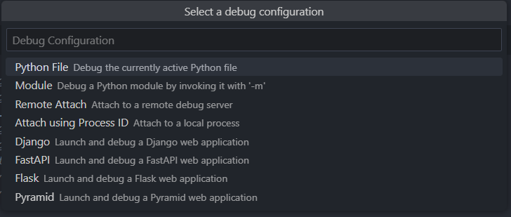
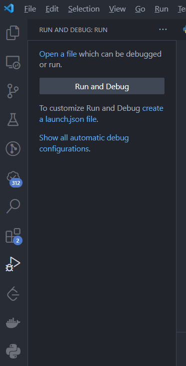

# 前端开发的Python学习笔记 快速开始

## 前言

有这样一句话，“人生苦短，我用Python”。
这话能够流传，就是因为Python简洁易学，相比其它语言，可以用更少的代码量和时间，完成同样的功能。

作为一个前端开发，日常工作和生活中，很多时候需要一些脚本，来处理冗余繁琐的操作，提升效率，特别是现有的工具难以满足需求，
这时候就想重新造个轮子，例如，编写脚本，从TTF字体文件中，仅提取出想要的中文字体；
对按规则匹配到的文件进行自定义的重命名，或者批量修改大量文件中的指定规则匹配的文本；
喜欢的网页文章或文档，能够自动将其抓取，然后转成PDF文件保存本地。

作为一门流行的编程语言，Python在人工智能，数据分析，Web开发，爬虫，自动化运维，图像处理等领域，都有对应的建树，拥有一个大而全面的生态。
之前笔者都是使用Gulp，在Nodejs环境下编写Js脚本，现在打算学习下Python，通过Python编写脚本，尝试下Python的生态。

本文主要记录自己学习Python的探索过程，从基础的安装，到运行起第一行Python代码。记录过程中遇到的问题，经过的流程，以及因为好奇心调研的
答案。这份记录也是为了自己准备的一份笔记，为的是当一段时间不用Python后，能够快速将之拾起。

笔者是前端出身，很多流程可能保留着使用Nodejs，npm构造前端工程的思路与想法。我相信一门成熟的语言与框架，总是殊途同归的，其语言特性，开发流程
总是存在共性。过程中我会尽可能做到知其然，知其所以然，保持好奇，保持追根究底，争取明白每一个流程的含义，设计理念，以及怎样使用。

## 概要

本文介绍了自己从安装Python，到编写出第一个程序并运行的流程。其主要包含如下几个部分：

* 下载安装，明确安装过程中出现的选项含义。
* 安装后进行一些常用配置，包括环境变量，国内镜像源，作为IDE的VSCode配置。
* 接下来，创建第一个Python文件，分别通过命令行和VSCode执行。
* 研究如何安装第三方依赖，尝试使用pip安装，以及使用requirements.txt保存依赖清单。
* 最后解决了一些疑问，例如多版本管理问题。

## 安装Python

笔者是Windows平台，安装的Python版本为3.11，首先前往 [官网](https://www.python.org/downloads/)下载安装包。


下载完成后，双击安装文件开始安装。之后进入安装流程的第一步。

### 选择安装方式


在第一个画面，选择安装方式为**Customize installation**，自定义安装，因为我习惯把软件安装到自己定义的目录，而非默认位置，
因此选择这个选项，后续可以自己指定安装位置。

底部两个选项默认勾选。

::: tip
* Use admin privileges when installing py.exe，这个选项选中，保证以管理员身份安装，防止缺少权限导致安装失败。
* Add python.exe to PATH，会自动添加Python.exe所在目录到环境变量Path。
:::

### 可选择的特性


在这个画面我选中了全部选项。

**documentation**

选择此选项后，会在本地安装一个文档程序，在开始菜单中，点击python 3.11 module docs，会自动打开一个本地网页，就是python文档。

**pip**

pip是下载安装python依赖包的核心工具，选择后，会安装在python安装目录下的Script文件夹中，后续会详细描述其用法。

**tcl/tk and IDLE**

tcl/tk是一个GUI工具包，用来用Python写图形界面的。
而IDLE是一个python的IDE开发环境，使用前者编写。
笔者这里虽然选中安装了，但是其实没有用Python编写图形界面的想法，并且IDE打算使用VSCode，因此这个选项看个人需求。

**Python test suite**

Python测试套件，需要安装，给一些工具方法写单元测试是好文明。

**py launcher**

这是一个window平台下的程序，可以让你运行不同版本的Python。安装后，直接通过命令行参数来控制使用哪一个版本的Python解释器。

同时安装了Python2和Python3时，环境变量Path下都有了两个Python命令，当在命令行输入`python --version`时，就只会匹配Path中靠前的指令。
想要能自由切换版本，就可以使用py launcher添加的 `py` 指令来替代`python`指令，手动指定要使用的Python解释器版本。
例如下面的方式：

```sh
# 在命令行中使用py命令运行python解释器，以python版本3的解释器，来执行指定的脚本
py -3.11 start.py
# 查看本机安装的全部python版本，参数中的0是列出python主要版本，p的意思是path，列举出所在路径。
py -0p
```


::: tip 命令行常用小操作
想知道py等指令存放的位置，可以直接在命令行中运行`where.exe py`，就可以查看其安装位置。
笔者使用的是Windows Powershell，其它命令行工具的where方法可能有所不同。
:::

### 高级选项


默认上述选项即可，然后选择想要安装的目标目录，然后点击安装。

安装完成后，可以打开命令行，运行`py --version`，如果能输出当前python版本，即表示安装成功。

这里大概解释下这些高级选项的含义。

**Install python for all users**

给windows全部用户安装python。对应的环境变量应该也会变成全局，而非当前User了。

**Associate files with python**

关联python文件，这样会自动识别对应后缀的文件为python脚本。如此，对py文件双击可以直接调用python解释器执行，而不需要选择打开方式。
不过笔者这里的py文件一般都关联的是VSCode，双击启动会自动打开VSCode。

**Add Python to environment varivables**

添加Python到环境变量中。

**Precompile python standard library**

预编译python标准库的.py文件为.pyc字节码文件，可提升使用标准库时的运行速度，当然也会占用更多安装时的额外空间。

**Download debugging symbols,Download debug binaries**

Download debugging symbols意味着下载用于调试Python的符号文件(.pdb文件)。
这些文件可以帮助你在Visual Studio等开发工具中调试混合模式的Python/C++代码。 如果你不使用Visual Studio或者不需要调试混合模式的代码，你可以不选择这个
选项。如果你选择了这个选项，你需要同时选择Download debug binaries，这样才能下载适用于.NET开发的调试符号。

## 安装后的配置

### 环境变量

python在安装过程中，经过选择对应选项，已经自动配置好了环境变量，因此**无需再额外手动配置**，这里仅介绍下相关的环境变量。


`\Python\Scripts\`：这个环境变量是用来存放一些Python的工具脚本文件的，比如pip或其他第三方模块的命令行工具。

`\Python`：这个环境变量是用来存放Python的主程序文件的，比如python.exe或pythonw.exe。

而py launcher使用的py命令，是放到了`C:\Windows`文件夹中。

可执行下面的命令来验证环境变量是否配置完善。  

```sh
# 输出python版本
py --version
# 输出pip版本
py -m pip --version
```

### 为pip配置国内镜像源

通过pip安装依赖时，都是从[国外的源](https://pypi.org/)下载，容易下载缓慢。推荐修改成清华大学的镜像源。  

一种方式是安装时临时指定，例如：

```sh
pip install -i https://pypi.tuna.tsinghua.edu.cn/simple Pillow
```

还有一种就是永久指定，推荐直接用这种方法：

```sh
# 配置源 会创建一个配置文件并写入配置 Writing to C:\Users\YourName\AppData\Roaming\pip\pip.ini
pip config set global.index-url  https://pypi.tuna.tsinghua.edu.cn/simple
# 打印pip配置
pip config list
# 如果不想用国内源了，还可以重置回 https://pypi.org/simple
pip config unset global.index-url
```

### IDE VSCode配置

直接在VSCode扩展处搜索python，安装常用的扩展：

* Python：调试，智能提示，格式化等基础功能支持。
* Python Indent：python风格的缩进支持。
* Python Environment Manager：管理多个版本的python

安装完成后，可以直接使用VSCode切换当前工作区的python解释器版本，实现命令行`py -3`指定版本的效果。
修改方法有以下几种，选择任意都可：

* 可以在VSCode底部栏修改。
* 使用安装的Python Environment Manager扩展，侧边栏会出现对应图标。
* ctrl+shift+p,输入`Python:Select interpreter`，进行选择。


## 工程构建与简单运行

安装与配置完成后，接下来就开始写下第一行代码，并执行。

1. 新建文件夹，命名随意，在内部添加一个`start.py`的文件，添加内容：

```py
# 即使没有接触Python语法，这里也能根据语义知道，是打印一行文字
print("Hello Python")
```
2. 使用VSCode打开文件夹，参考配置章节的VSCode配置，指定好当前的解释器版本。

3. 接着F5，弹出选择执行方式，以**module**方式执行即可，模块名填写为**start**，也就是目录下的py文件名，可以看到控制台打印出了相关文本。
   关于以其它方式执行的差异，后续会说到。



4. 通过F5运行程序，可以进入断点，也可以在断点的上下文内查看变量当前内容。

5. 如果不使用VSCode自带得调试，而是使用命令行，可以执行如下：

```sh
# 以脚本形式运行，只要路径正确，就能执行
py start.py
# 以module形式运行 关于module的概念，使用方法，和脚本文件的差异，会在后续介绍
# 添加了-m后，python会在sys.path和当前项目中查找对应的名为start的module，然后作为脚本执行
py -m start
```

::: tip
VSCode的各种操作，本质都是图形化的，对命令行指令的封装。
因此所有VSCode操作都应该有对应的命令行版本。
:::

## 依赖管理

安装Python时，选择了安装pip，这是Python的包管理器，使用pip指令进行各种第三方依赖的安装，更新，删除，查看等。

### 全局安装

直接执行安装指令`py -m pip install Pillow`，会发现，当前项目下并无任何变化，找不到安装的依赖在哪里，
这是因为直接执行pip，会默认把依赖包安装到全局。
执行`py -m pip show Pillow`可以查看到详细的包信息，发现包被安装到了Python安装目录下的一个文件夹中：
`D:\workspace\install\python\Python\Lib\site-packages`。 

默认使用pip的全局安装，容易导致多个项目的依赖产生版本冲突，所以并不推荐。后面虚拟环境章节，会介绍在虚拟环境中，使用pip安装管理依赖。
此种方法安装的依赖会独立于全局，能更好的管理，控制，维护。

::: tip
`py -3 -m pip install Pillow`，这里的指令含义：
* py 使用py launcher。
* 后面可以跟着一个-3，表示指定python3。
* -m 是使用module，这里会从`sys.path`数组中查找对应目录，会在``\Python\Scripts\`下查找到的名为**pip**的**module**。
* pip就是找到的Module。
* install 是 pip支持的安装指令。
* Pillow是要安装的依赖名字。
:::

### 使用requirements.txt

此文件是一个安装的依赖及其版本的清单，当下载一个新项目时，可以用其快速安装依赖。

当已经有requirements.txt时，例如是下载的别人的项目，想快速安装全部依赖，可以运行如下指令：

```sh
# -r是read读取，读取文件中的清单，然后全部安装
pip install -r requirements.txt
```

如果使用pip安装依赖，`pip install package_name`，是不会更新requirements.txt的(当然是有三方的包管理工具能实现同步的)。这需要我们手动去执行指令，
创建或更新requirements.txt：

```sh
# 列出全部安装的依赖，并写入文件
py -m pip freeze > requirements.txt
```

### 包管理工具

有**pipenv**，**poetry**等工具，但当前Python自带得pip和venv已经够用，暂时没有学习使用其它包管理工具的需求。

### 引入安装的第三方依赖包

安装的依赖包非常简单，各个包文档一般都会标明使用方式，可以自行查询文档，例如Pillow：`from PIL import Image`

## 其它问题

### 多python版本操作

当电脑安装了多个python版本，就需要使用py launcher的`py`指令来调用不同版本python解释器。  
直接调用`py`，会运行最近安装的python版本。  
使用参数指定版本，可以运行`py -3.11`来指定python版本。  
如果想指定一个`py`的默认版本，则需要windows环境变量`PY_PYTHON`，此变量不存在时，会默认为3。 

可以通过命令行实验一下：
```sh
# 默认打印空
$env:PY_PYTHON
# 默认为3 Python 3.11.3
py --version
# 设置为版本2
$env:PY_PYTHON = 2
# 打印为Python 2.7.18
py --version
# 设置为3
$env:PY_PYTHON = 3
# Python 3.11.3
py --version
```

当使用pip时，如果想要指定版本，需要
```sh
py -m pip --version
```
如果希望直接使用pip，并指定版本，那就只能调整下`\Python\Scripts\`环境变量的顺序了，把想要的版本排在上面，如此直接
使用`pip --version`即可。

### VSCode如何指定F5的运行方式

**创建VSCode启动文件**

使用F5启动调试时，发现会默认执行当前选中的文件，以此为入口。要修改其执行的入口，则需要创建`.VSCode/launch.json`，
通过此配置文件，控制调试时的一些行为。

打开侧边栏的`Run and Debug`，会发现上方有文字按钮**create a launch.json file**，点击按钮，
依旧出现选择执行方式，这里还是选择`Module`，提示填入启动的模块名，这里填入的Modules名字即为下面的.py文件名，
接着自动自动创建了`.VSCode/launch.json`。



打开文件`launch.json`文件，生成得`launch.json`如下，以Module方式运行，同时入口Module为start。
如果想单独调试其它子文件模块，可以修改Module后执行，例如修改为`your_package.package1.unit1`，就会以模块方式
调用`your_package/package1/unit1.py`，如果添加的是目录，则会执行目录下的`__init__.py`。

```json
{
   "version": "0.2.0",
    "configurations": [
        {
            "name": "Python: Module",
            "type": "python",
            "request": "launch",
            "module": "start",
            "justMyCode": true
        }
    ]
}
```

## 总结

## 参考

[Python in VSCode](https://code.visualstudio.com/docs/languages/python)

[Python Environment Manager文档](https://marketplace.visualstudio.com/items?itemName=donjayamanne.python-environment-manager)

