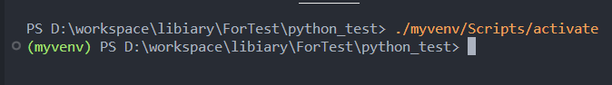
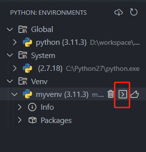

# 虚拟环境

## 使用虚拟环境

如果电脑上存在多个复杂项目，把依赖安装到全局并非是好选择，这时候就想尽可能让项目自己包含依赖，从而实现更好的独立，避免依赖版本不同发生冲突。

虚拟环境是一个轻量的Python环境，是基于全局已经存在的Python安装来构建。
其内部的Python解释器，pip，依赖包，都是独立于全局系统级别的，这样对应的项目就能自成一体。

这样的好处：

* 你的开发环境被固定化到了一个项目中，和全局与其它虚拟环境实现了隔离。
* 可以很简单的打包应用或者分享应用。

::: tip 举个例子
最近安装Stable Diffusion WebUi，各种一键安装工具，本质都是打包一个python虚拟环境，以及Git，然后解压到本地，
之后在目录下，先进入虚拟环境，然后运行`pip install`，如此，用户不需要在本机安装Python，即可直接运行起一个Python项目。
:::

### 使用venv创建虚拟环境

其会将Python库拷贝或者链接一份到项目目录下，然后在该项目中，临时修改环境变量Path，让其指向当前项目下的Python库。

在命令行中运行以下指令，在当前目录下，创建一个虚拟环境。

```sh
# 最后一个参数是命名的虚拟环境变量名称
py -m pip venv myvenv
```

运行完成后，项目会多出一个名为`myvenv`的文件夹，其目录内就是一个Python环境，存放于项目之下。

这个虚拟环境目录下包含：
* Scripts：包含了Python环境自身，内部有`Python`,`pip`这些核心指令工具，还存在`activate`,`deactivate`这些操作虚拟环境的脚本。
* Lib：则包含了Python需要的依赖包，包括基础库和安装的第三方依赖包。
* Include：目录是存放`.h`的header文件的，可能是空的。

### 激活虚拟环境

创建虚拟环境后，还需要激活，进入虚拟环境的命令行模式，此模式下，进行的相关pip操作，例如安装，查看，更新等，都会限定到虚拟环境中。
此时终端命令前缀会显示一个`(虚拟环境名)`。  

**使用命令行**
  
如果使用命令行，则需要找到venv文件夹下的activate可执行程序，并运行`./myvenv/Scripts/activate`  



```sh
# 当前目录下，运行activate文件，即可激活虚拟环境
./myvenv/Scripts/activate
# 退出虚拟环境，直接在虚拟环境下，运行即可，无需指定路径
deactivate
```

**使用VSCode**

有以下两种方式：

1. 切换到虚拟环境解释器。`ctrl+shift+p`,输入python，选择`Python:Select interpreter`，其中会看到虚拟环境的解释器，并选择。

   

2. 使用插件只需要找到插件显示得对应env内的环境，然后选择`Open in terminal`或者`Set as active workspace interpreter`  

    

如此在虚拟环境命令行中，运行`py -m pip install Pillow`，其对应的依赖，也会被安装下项目下的`myvenv\Lib\site-packages`文件夹下,而非全局。

### 使用虚拟环境

启用虚拟环境后，在VSCode中，不论通过F5运行，还是通过命令行指令执行，都会在当前虚拟环境中生效，也就是使用虚拟环境的Python解释器，
以及安装三方依赖包时会安装到本地项目目录下。

## 参考

[虚拟环境的提案](https://peps.python.org/pep-0405/)

[怎样设置Python虚拟环境](https://www.freecodecamp.org/news/how-to-setup-virtual-environments-in-python/)

[venv](https://docs.python.org/3/library/venv.html)


