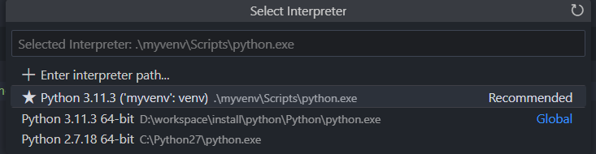

# 前端开发的Python学习笔记 虚拟环境

## 概要

`npm install -S package_name`，这是前端开发使用npm安装依赖时的常用指令，该指令会将依赖安装到工程目录下的`node_modules`文件夹。
只有全局级别的常用工具库(例如rimraf，npm-check等)，我们才会给指令添加`-g`参数，`npm install -g package_name`，安装到全局。

上篇文章《快速开始》中，我们在使用pip安装第三方依赖包时，发现依赖被默认安装到了全局。那么有什么方法，能让Python的依赖，
都安装到本地项目文件夹中吗？

本篇文章所介绍的**虚拟环境**，就能让Python项目拥有一套独立得Python环境与三方依赖库，与系统全局相分离。

这样的好处：

* 你的开发环境被固定化到了一个项目中，和全局与其它虚拟环境实现了隔离。
* 可以很简单的打包应用或者分享应用。

举个例子，最近安装Stable Diffusion WebUi，各种一键安装工具，本质都是打包一个python虚拟环境，以及Git，然后解压到本地，
之后在目录下，先进入虚拟环境，然后运行`pip install`，如此，用户不需要在本机安装Python，即可直接运行起一个Python项目。

那么，本文就从虚拟环境的设计提案开始，了解其根源与背景，接着学习使用venv，创建，激活，使用虚拟环境。

## 设计提案

虚拟环境提案，提出了一种为Python添加轻量级的“虚拟环境”的机制，这些虚拟环境有自己的site目录，可以选择与系统site目录隔离。每个虚拟环境都有自己的Python二进制文件（允许创建具有不同Python版本的环境），并且可以在其site目录中有自己独立的已安装Python包集合，但是与基本安装的Python共享标准库。

在官方的**venv**出现前，社区中已经有了流行的第三方解决方案，例如**virtualenv**，但是这些三方库，它们缺少了Python自身对其的支持，存在各种缺点，
例如不够轻量，全平台兼容性不好等。

因此，就出现了**venv**，借鉴了第三方工具的经验，同时又与Python自身集成，带来了更好的可维护性，可靠性。


## 使用venv创建虚拟环境

创建虚拟环境的过程，就是拷贝/链接Python解释器，脚本工具(例如pip)到指定项目目录下，并修改`sys.prefix`等变量，使得解释器执行时，能够查询指定的标准库模块。

先进入已经建立好的项目目录中，在命令行中运行以下指令，即可在当前目录下，创建一个Python虚拟环境。

```sh
# 最后一个参数是命名的虚拟环境变量名称
py -m pip venv myvenv
```

运行完成后，项目会多出一个名为`myvenv`的文件夹，其目录内就是一个Python环境，存放于项目之下。

虚拟环境目录下包含以下内容：

* Scripts：包含了Python环境自身，内部有`Python`,`pip`这些核心指令工具，还存在`activate`,`deactivate`这些操作虚拟环境的脚本。
* Lib：则包含了Python需要的依赖包，包括基础库和安装的第三方依赖包。
* Include：目录是存放`.h`的header文件的，可能是空的。
* pyvenv.cfg配置文件，创建虚拟环境的配置文件，其中
  * home 创建虚拟环境的Python安装目录
  * include-system-site-packages 是否可以访问系统的site-packages
  * version 虚拟环境使用的Python版本

## 激活虚拟环境

创建虚拟环境后，还需要激活，进入虚拟环境的命令行模式，此时会修改Path环境变量，令Python指令指向项目目录下的虚拟环境，
因此，进行的相关python操作，pip操作，例如安装，查看，更新等，都会限定到虚拟环境中。
此时终端命令前缀会显示一个`(虚拟环境名)`。

**使用命令行**
  
如果使用命令行，则需要找到venv文件夹下的activate可执行程序，并运行`./myvenv/Scripts/activate`  


```sh
# 当前目录下，运行activate文件，即可激活虚拟环境
./myvenv/Scripts/activate
# 退出虚拟环境，直接在虚拟环境下，运行即可，无需指定路径
deactivate
```

**使用VSCode**

有以下两种方式：

1. 切换到虚拟环境解释器。`ctrl+shift+p`,输入python，选择`Python:Select interpreter`，下拉列表中会看到虚拟环境的解释器，选择要激活的虚拟环境即可。

   

2. 使用插件。只需要找到插件显示得对应env内的环境，然后选择`Open in terminal`或者`Set as active workspace interpreter`  

    

## 使用虚拟环境

如此在虚拟环境命令行中，运行`py -m pip install Pillow`，其对应的依赖，就会被安装下项目下的`myvenv\Lib\site-packages`文件夹下,而非全局。

进行F5调试时，也会默认使用虚拟环境中的Python解释器。

## 参考

[虚拟环境的提案](https://peps.python.org/pep-0405/)

[怎样设置Python虚拟环境](https://www.freecodecamp.org/news/how-to-setup-virtual-environments-in-python/)

[venv](https://docs.python.org/3/library/venv.html)


