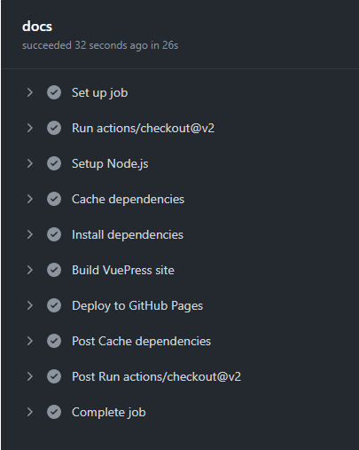
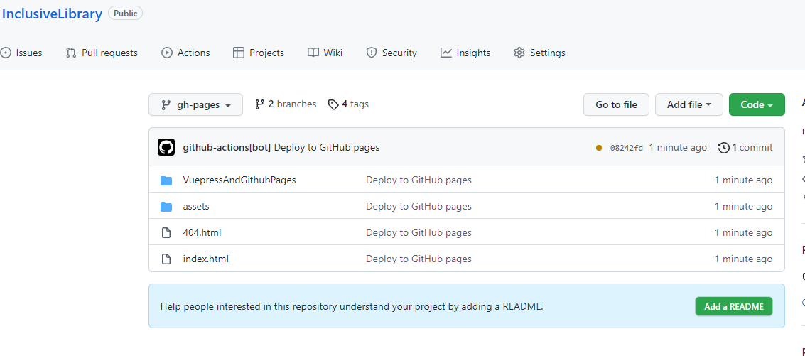
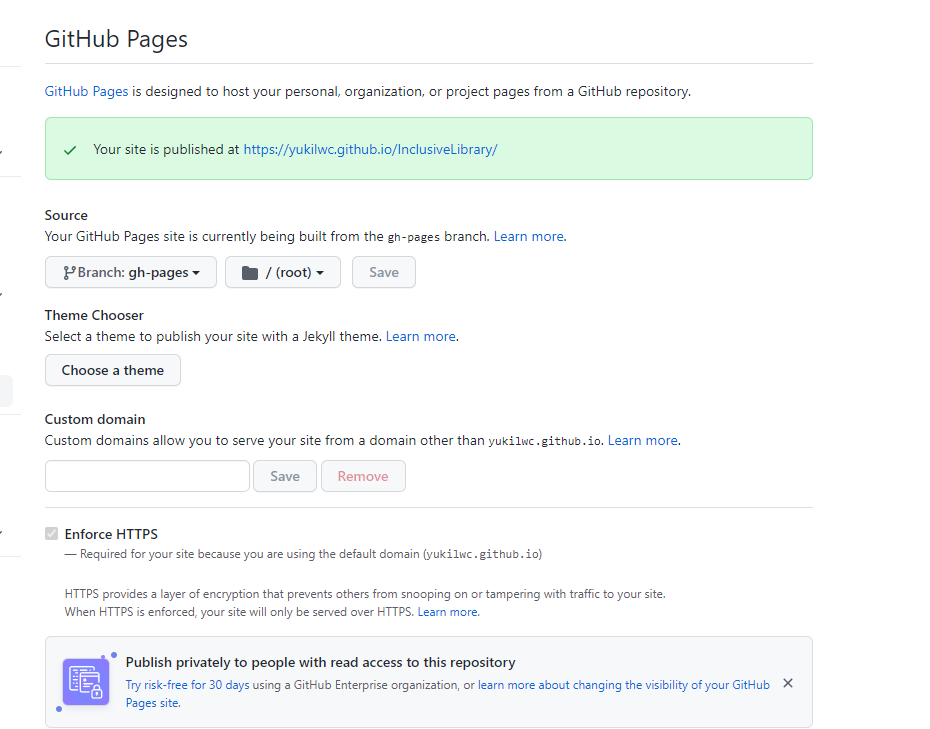

# Vuepress2.0和Github pages搭建博客

## 概要

### 为何选择Vuepress2

一般的博客，其内容，基本以纯文本，额外加上一些图片等为主，使用Hexo等博客框架就非常合适，模板众多，功能齐全，开箱即用。

但是对于程序员来说，特别是前端程序员，博客不仅仅需要写文章，写心得,还要有集成工具库文档，组件库文档，或者一些封装的组件的功能，也就是博客和文档一体化，由此，我选择Vuepress2来作为我的博客框架。  

Vuepress2.0满足了我以下需求：
1. 使用Vue服务端渲染作为核心框架，方便后续进行样式，甚至整体的首页，页脚，导航等的定制化开发，即符合我自身技术栈的主题开发。
2. 我是主打Vue的前端开发，后续如果需要创建自己的UI组件库，则使用Vuepress2会更加方便构造和展示。
3. 2.0版本开始，全面支持了Vue3和typescript，组合式API和类型化，其好处不必多说。

### Github pages

一般此类纯静态页面，是不需要数据库的，也就是静态资源只需要部署到一个简单的http服务器上就好,只提供基础的静态资源部署。 
如此，去专门购买一个阿里云之类的服务器就很不划算，用不起来，而github pages刚好  


### Github actions

## 基础工程搭建 

### 创建一个github仓库

在自己的账号上，任意创建一个github仓库，并将改仓库clone到本地。

### 创建vuepress项目

1. 在clone到本地的仓库文件夹中，安装vuepress框架

```sh
npm install -D vuepress@next
```

2. 在package.json文件中，配置启动和编译的脚本,个人喜欢使用```npm run dev```和```npm run build```

```json
{
  "scripts": {
    "dev": "vuepress dev docs",
    "build": "vuepress build docs"
  }
}
```

3. 别忘了添加一个.gitignore文件,用来忽略一些依赖和缓存的git版本控制

```
node_modules
.temp
.cache
```

4. 在根目录下，创建一个docs文件夹，并添加一个README.md文件,添加内容

```md
# hello vuepress
```
接着，在根目录下执行```npm run dev```,启动项目，可以在启动网址中看到初始画面

5. 新建```/docs/.vuepress/config.ts```文件，作为配置文件
```ts
import {defineUserConfig,DefaultThemeOptions} from 'vuepress'
export default defineUserConfig<DefaultThemeOptions>({
  // site config
  lang: 'zh-CN',
  title: '我的博客',
  description: '学习，工作，生活',
  // theme and its config
  theme: '@vuepress/theme-default',
  themeConfig: {
    logo: '',
  },
})
```
<!-- TODO: -->
6. 更多关于vuepress的配置与使用，可以看另一篇文章[Link]()

## 自动化部署

### 添加Github Actions

1. 根目录下创建```.github/workflows/deploy.yml```

```yml
name: deploy vuepress blog

on:
  # trigger deployment on every push to main/main branch
  push:
    branches: [master,main]
  # trigger deployment manually
  workflow_dispatch:

jobs:
  docs:
    runs-on: ubuntu-latest

    steps:
      - uses: actions/checkout@v2
        with:
          # fetch all commits to get last updated time or other git log info
          fetch-depth: 0

      - name: Setup Node.js
        uses: actions/setup-node@v1
        with:
          # choose node.js version to use
          node-version: "14"

      # cache node_modules
      - name: Cache dependencies
        uses: actions/cache@v2
        id: npm-cache
        with:
          path: |
            **/node_modules
          key: ${{ runner.os }}-npm-${{ hashFiles('**/package-lock.json') }}
          restore-keys: |
            ${{ runner.os }}-yarn-

      # install dependencies if the cache did not hit
      - name: Install dependencies
        if: steps.npm-cache.outputs.cache-hit != 'true'
        run: npm install

      # run build script
      - name: Build VuePress site
        run: npm run build

      # please check out the docs of the workflow for more details
      # @see https://github.com/crazy-max/ghaction-github-pages
      - name: Deploy to GitHub Pages
        uses: crazy-max/ghaction-github-pages@v2
        with:
          # deploy to gh-pages branch
          target_branch: gh-pages
          # deploy the default output dir of VuePress
          build_dir: docs/.vuepress/dist
        env:
          # @see https://docs.github.com/en/actions/reference/authentication-in-a-workflow#about-the-github_token-secret
          GITHUB_TOKEN: ${{ secrets.BLOG_TOKEN}}


```

2. 在github中生成secret key.

在github中，打开 ```setting--Developer Settings--Personal access tokens```,点击generate new token按钮,勾选一些工作流相关的权限后，点击生成token.

3. 给仓库添加Actions secrets.

打开博客仓库，打开```setting--secrets--actions```,点击创建仓库密钥按钮，name字段填入BLOG_TOKEN,该名称必须与yml脚本中的字段同步。之后，在下面填入上一步创建的token,点击完成。

4. 推送本地main分支到远程,在github对应仓库的actions下，可以看到流水线日志.最终应该在仓库中创建了一个新的gh-pages分支，作为vuepress编译的打包文件。





### 配置github pages

1. 如果仓库并非命名为Yukilwc.github.io的根路径仓库，则需要配置vuepress的base字段

```ts
export default defineUserConfig<DefaultThemeOptions>({
    base:"/YourRepoName/",
})


```

2. 打开```目标仓库--settings--pages```,发现，当存在gh-pages分支时，github自动将其作为了github pages并生成了访问链接


## 参考

[Vuepress v2](https://v2.vuepress.vuejs.org/)

[github docs](https://docs.github.com/en/authentication/keeping-your-account-and-data-secure/creating-a-personal-access-token)

[github actions](https://docs.github.com/en/actions/quickstart)

[github pages](https://docs.github.com/en/pages/quickstart)