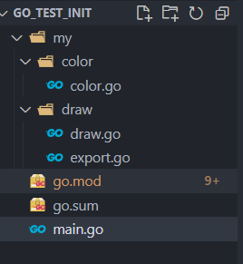
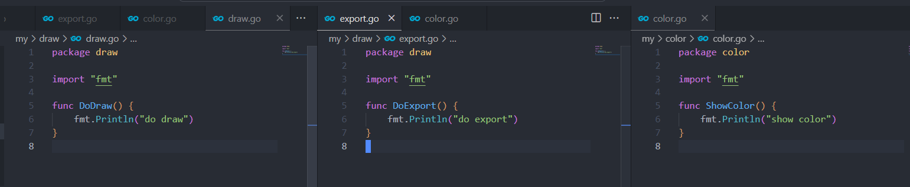
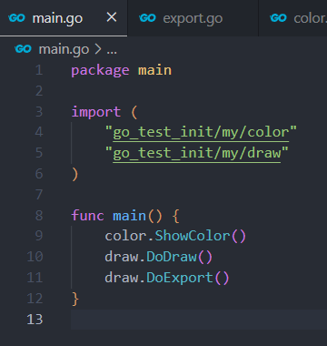

# Go安装配置与简单项目搭建

## 概要

本文记录Go的环境搭建与基本使用流程，从安装与配置环境变量开始，搭建一个可运行，可编译的demo项目，
并简单的介绍下Go模块的使用。  

::: tip 注意
文中的环境均为window10系统，Go版本为go1.19.2
:::

## 安装


从 [官网](https://go.dev/dl/) 下载安装包，进行安装。这里安装位置使用默认安装位置，安装到`C:\Program Files\Go\bin`。

## 环境变量

Go安装完成后，需要保证一些环境变量的配置，具体介绍如下: 

### 安装后的环境变量

Go本身安装完成后，会自动添加以下环境变量。如果查看电脑环境变量，发现缺失了配置，则可以手动进行添加。
* 系统变量，PATH添加Go安装目录下的bin文件夹：`PATH=C:\Program Files\Go\bin`
* 用户变量，添加GOPATH,指定其为Go的工作区：`GOPATH=%USERPROFILE%\go`
* 用户变量，PATH添加Go工作区目录下的bin文件夹：`PATH=%USERPROFILE%\go\bin`。其放置了项目的可执行文件，同时`go install`生成的exe文件也会放入其中。

### Go开发配置环境变量

Go自身还维护了很多其专属的环境变量。当Go版本大于1.13时，可以直接使用`go env`指令查看和设置。  
* 使用`go env`查看全部变量。
* 使用`go env 变量名`查看指定变量。
* 使用`go env -w 变量名=设置值`设置指定变量，并且关闭命令行工具后依然有效 。

以下介绍几个重要的环境变量:

**GOROOT**：Go的安装目录  

**GOPATH**： Go的工作区目录，其下包含三个文件夹:
* src：存放用户项目源码，但是在使用go mod后，就不需要必须在此文件夹中建立项目了
* pkg：编译后的库文件
* bin：可执行文件

**GOOS**： 操作系统

**GOARCH**： CPU架构,与GOOS一起配置，用于交叉编译，指定build的目标系统

**GO111MODULE**： go modules开关，一般开启设置为on

**GOPROXY**： **必要配置**,`go env -w GOPROXY=https://goproxy.cn,direct`


## 创建与运行项目

### 创建

```sh
# 创建项目目录
mkdir go_test_init
cd go_test_init
# 模块初始化 会自动生成go.mod文件
go mod init go_test_init
```
::: tip GO111MODULE=on时的依赖查找机制
内容
:::

### 代码与执行

创建一个`main.go`文件，写入如下代码
```go
package main
import "fmt"
func main() {
	fmt.Println("hello go")
}
```

执行`go run main.go`,打印出信息

### 安装三方模块与引入
这里拿一个第三方包Gin进行举例。

**安装Gin包**

```sh
go get -u github.com/gin-gonic/gin
```
**导入后的变动**

`go.mod`文件会被写入对应require依赖，同时会自动生成`go.sum`包，管理依赖关系。一般不会去修改`go.sum`包,其类似前端的`package-lock.json`,
主要负责依赖树的管理。

**使用Gin包**

```go
package main
import (
	"fmt"
	"github.com/gin-gonic/gin"
)
func main() {
	fmt.Println("hello go")
	r := gin.Default()
	r.GET("/", func(ctx *gin.Context) {})
	r.Run()
}
```

**已有go.mod安装依赖**

如果是从github下载了已有的Go项目，则直接运行`go run main.go`即可，`go.mod`中的依赖会自动下载。

### 导入本地模块

首先创建如下文件结构



在三个包文件中定义需要导出的函数，函数使用大驼峰命名，Go会将首字母大写的变量，视为要导出的公共变量。  



最后在main.go中导入,包前缀的`go_test_init`即为顶层`go.mod`中的`module go_test_init`声明



::: tip  模块文件结构设计
注意，一个文件夹下的全部文件，必须声明为同一个package,声明不同package会报错。  
如果是嵌套的文件夹，则可以声明为不同的package。  
包的命名最好和文件夹保持一致，全小写，不适用复数。  
:::


## 编译

运行`go build main.go`即可。会在目录下生成exe文件。  

## 使用vscode


### 安装插件与依赖

1. 安装Go扩展
2. 打开一个Go项目，`ctrl+shift+p`,查找指令`Go:Install/Update Tools`,全部选中后安装即可。  

## 参考

[Vscode使用go插件](https://learn.microsoft.com/zh-cn/azure/developer/go/configure-visual-studio-code)

[go mod文档](https://go.dev/ref/mod#go-mod-init)