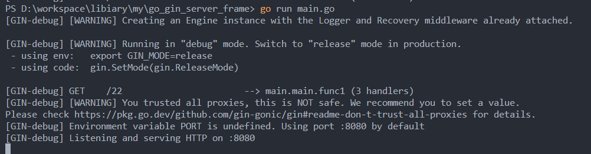

# 使用Gin搭建GO服务端

## 概要

本文记录搭建一个基于Gin的GO服务端框架的基本流程。  
主要内容包括基本工程结构搭建，使用Gin编写Restful接口，以及连接操作数据库。

## 工程目录设计

最简单的工程版本如下，参考了[GoFrame的工程结构设计](https://goframe.org/pages/viewpage.action?pageId=30740166) 
```sh
├─.gitignore
├─go.mod
├─main.go
├─resource
├─manifest
|    ├─config
├─internal
|    ├─service
|    ├─model
|    |   ├─entity
|    |   ├─do
|    ├─logic
|    ├─dao
|    ├─controller
|    ├─consts
|    ├─cmd
├─hack
├─api
```

| 目录/文件名 | 说明 | 描述 |
| ----------- | ---- | ---- |
|             |      |      |
|             |      |      |

## 一个简单的Gin demo

我们先从一个简单的demo开始，逐步再进行分层迭代，优化结构。

首先进行目录创建与mod初始化：
```sh
mkdir go_gin_server_frame
cd go_gin_server_frame
go mod init server
```

安装Gin
```sh
go get -u github.com/gin-gonic/gin
```

根目录下，创建main.go，写入如下代码：
```go
package main

import (
	"net/http"

	"github.com/gin-gonic/gin"
)

func main() {
	r := gin.Default()
	r.GET("22", func(c *gin.Context) {
		c.JSON(http.StatusOK, gin.H{"message": "33"})
	})
	r.Run()
}
```

最后运行指令：
```sh
go run main.go
```


于是一个简单的服务就运行起来啦，浏览器访问`localhost://8080/22`，可以接收到返回`{"message":"33"}`


## 分层设计其一

上述仅仅是一个见到的demo，真正的工程必然不可能是全都塞进`main.go`中的，因此需要设计一种分层机制，提高代码的可维护性，
践行单一职责原则，做到低耦合高内聚。

## 数据库基础设施


## 分层设计其二

## 参考

[GoFrame工程开发设计](https://goframe.org/pages/viewpage.action?pageId=3672442)

[Gin文档](https://github.com/gin-gonic/gin#contents)