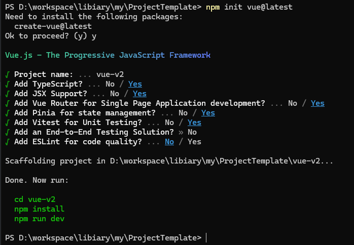

# Vue v2版本模板搭建

## 工程目录创建

依据vue官网，创建工程。官网脚手架的`create-vue`是默认基于Vite的，直接使用即可。  
```sh
npm init vue@latest
# 进入项目文件夹中
npm install
```

选择如下:



其中，安装了ts支持，jsx支持，路由，pinia全局状态管理,vitest单元测试。  
而cypress这类E2E测试框架，eslint我这不用则不安装。

## IDE配置

使用VSCode，禁用**Vetur**,安装使用**Volar**

### use take over mode instead of this plugin.

## npm安装一些常用依赖

### 安装

```sh
npm install --save-dev sass
npm install --save qs
npm install --save axios
npm install --save @vueuse/core
npm install --save js-cookie
npm install --save element-plus
npm add -D @vitejs/plugin-legacy
```

### 一些配置

#### element-plus

不论按需还是全局，参考官网即可。