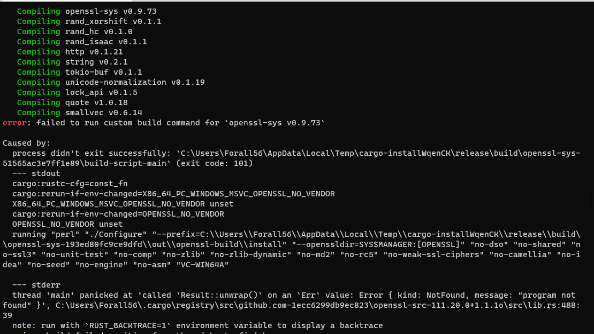

# Rust应用转Wasm

## 环境搭建

[参考Rust环境搭建](../../../Tools/EnvironmentSetup/Rust/README.md)

之后，运行`cargo install wasm-pack`,安装把rust编译成wasm的工具。

### 异常处理

关于报错:`error: failed to run custom build command for openssl-sys v0.9.73`,只是因为rust-openssl依赖了Openssl,需要提前安装  
Openssl并配置环境变量。



解决:

1.windows安装opensssl: [Link](http://slproweb.com/products/Win32OpenSSL.html)

2.环境变量设置，不同终端设置方法不同.[Link](https://www.heyqz.fun/2021/06/12/Windows%E4%B8%8D%E5%90%8C%E7%BB%88%E7%AB%AF%E7%8E%AF%E5%A2%83%E5%8F%98%E9%87%8F%E8%AE%BE%E7%BD%AE/)
* `$env:OPENSSL_NO_VENDOR=1`  令rust编译open-ssl时，不适用Perl来编译source，而是直接使用预先编译好的openssl
* `$env:OPENSSL_DIR="C:\Program Files\OpenSSL-Win64\"` 指定openssl编译后的目录，rust会自动从中查找include,bin等文件夹，编译rust-openssl
* `$env:VCPKG_ROOT="C:\Program Files\OpenSSL-Win64\"`,不确定是否有效，官方文档说是**The openssl-sys crate will automatically detect OpenSSL installations via Homebrew on macOS and vcpkg on Windows.**,也就是指定VCPKG目录可能也能提供预编译的openssl目录？

最后，安装编译wasm-pack成功


### 异常处理参考

[参考](https://github.com/rustwasm/wasm-pack/issues/1108)

[参考](https://docs.rs/crate/openssl/0.9.24)

[参考](https://stackoverflow.com/questions/68646684/cant-install-cargo-wasm-pack)

[Link](https://docs.rs/openssl/latest/openssl/)

## 样例


### 运行

<Rust2WasmDemo></Rust2WasmDemo>

### 工程构建

```sh
cargo new --lib hello-wasm
```

## 实践pngquant转wasm

## 参考

[pngquant文档](http://pngquant.com/install.html)

[pngquant lib](https://pngquant.org/lib/)

[MDN WebAssembly Rust_to_wasm](https://developer.mozilla.org/en-US/docs/WebAssembly/Rust_to_wasm)

[wasm-bindgen文档](https://rustwasm.github.io/docs/wasm-bindgen/)